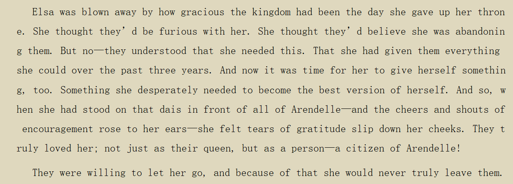
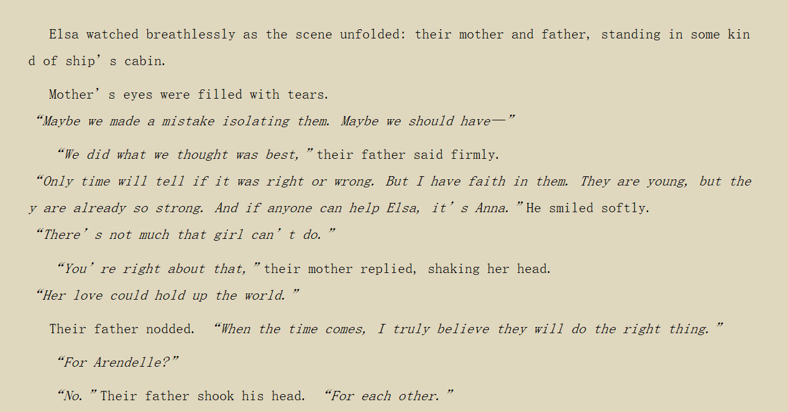

# **饮茶室QA草稿**

本文档有两大核心部分

​                ● 核心FAQ，给新人看的，提供对常见问题保险、稳妥、本群争议较少的答案

​                ● 围绕FAQ的补充说明文档，包含对同一问题的其他视角解读、一些深入的讨论

​                ○ 分成文本、创作、世界观、观众、其它五个部分。

​                ○ 文本部分包含针对电影、小说的多视角分析和解释，例如莎雕问题；

​                ○ 创作部分包含对冰二F2创作过程的分析，例如“为什么冰二没这么写，Elsa该不该永生”，以及群侑对F3的展望；

​                ○ 世界观部分包含对冰雪系列总体世界观、设定细节的分析和讨论

​                ○ 观众部分包含对搞冰学的人脑袋里在想什么的研究和讨论，即冰学观众理论

​                ● 编辑原则：上述六个部分互有指涉，添加内容前需要先确定内容侧重点

# **核心FAQ**

## **你群是干嘛的**

（隔壁老王）

​                ● 本群的主要内容是冰学分析和Elsa x Anna向开车

​                ● 冰学是基于官方资料的分析冰雪奇缘系列的严肃向解读

​                ● 冰学内容可以查看精华消息和群文件

​                ● 本群欢迎讨论正常的冰雪couple（cp），不欢迎Jack Frost x Elsa (je), Hans x Elsa (he), ne等非正常cp

​                ● 本群可以讨论Walt Disney Animation Studio (WDAS)其他动画，美国其他的动画公司的动画，霓虹动画电影，甚至二次元

​                ● 本群讨论内容丰富，可以讨论配音，作曲，画画，写同人，构想冰雪奇缘三的剧情

​                ● 此外，本群不欢迎敏感话题，请酌情发言，不欢迎人身攻击，欢迎正常辩论

​                ● 对冰雪奇缘ip有兴趣的群友可以先补FF、OFA的动画短片，然后还有一些着重世界观刻画的官方动画，如Myth、雪宝剧场、北极光、雪宝宅家，

​                ● 建议观看迪士尼真人剧童话镇S4E1-E12

## **常见****缩写**

Elsa: E

Anna: A

### **电影与短片**

冰雪奇缘1：冰一

冰雪奇缘2：冰二

Frozen Fever：FF

Olaf’s Frozen Adventure: OFA

### **小说**

Forest of Shadow: FOS

Dangerous Secret: DS

Polar Nights: PN

A Frozen Heart: AFH

All is Found: AIF

 

## **冰雪奇缘的主旨**

Two sisters hold up the Frozen world and unfreeze everything with love together

 

## **关于****冰****二****的****Ahtohallan**

### **Q：冰雪奇缘2里面那个记忆冰川到底是啥运作方式啊**

A：FH: short answer: We still don’t know much.只能说水有记忆，然后经过水循环世界各地都有一部分“见证过”各种事情的水以降雪的形式落在Ahtohallan上, 冰川作为多年降雪的累积形成因此就变成了一个巨大的记忆储存库。而Elsa的魔法则有具像化水中记忆的能力。

### **Q: 艾莎能随时去冰川那里知道一切她想知道的事情吗？**

A: FH: 理论上可以，但有些记忆埋的太深或者是Elsa自己本人所抗拒的，这种就需要Elsa去go too far 来探索，有把自己冻在Ahtohallan里的风险，就像F2所展示的那样

### **Q: 艾莎妈妈是怎么通过那个冰川呼唤她的啊****/****谁在呼唤****Elsa**

A: FH: 那个并非Iduna（EA母亲）的灵魂的呼唤，是Ahtohallan的意识调用了Iduna的声音的记忆用来呼唤Elsa.这个冰川你目前可以理解为冰雪世界的创世神

### **Q****：****那为什么在唱show yourself的时候艾莎还非常感动地喊了一声mother？**

A: FH: 因为看到iduna了。也可以认为是“因为知道是母亲一直在指引自己很感动来着”

见**母女线分析**

 

### **Q: 冰川为什么会有意识？**

A: FH: 在show yourself 这首歌的历程中冰川里指引Elsa的光线你看到了吧？

不是自然之灵，我最早也是这么认为的，但你想在Ahtohallan里引导Elsa的四灵能量肯定不会和外面那几只吉祥物是同一个东西，是个智慧更高的存在，早期我曾提出有“四大灵”存在代表了四元素而森林里那几只就像Elsa和Olaf的关系一样。后来PN小说实锤了Ahtohallan是有意识的而且是the mother spirit 四灵之母，那之前一切“四大灵”的表现都是Ahtohallan这个mother spirit所为了

还有在Elsa跳下悬崖冻住前背景里有一句Dive down deep into her sound, but not too far or you’ll be drowned 的歌词，冰川里是有一个意识体的存在的

Ahtohallan有意识这件事是在Polar Nights这本小说里实锤的

### **Q：那个冰川实际上是一个神？而且能操控那四个元素之灵？**

A: FH: 目前来说可以这么理解，这玩意是四灵的妈

### **Q：为什么不直接控制那个石头巨人把大坝砸了，还兜这么一个大圈子**

A: FH: 这个解释起来就复杂了，总结下来就是作为“创世神”你是希望设好规矩让造物依照规矩和条件自行运转而不是每件事都要自己亲自插手。Ahtohallan绕这么一大圈的意义是让人类自己挖掘出真相并让Arendelle的代表自己做出抉择是否要以沉重的代价修正错误。只有让真相大白让Arendelle那边认识到错误之后两地人才能和平共处

### **Q：这就更不合理了啊？明明是电影的IP，所有的问题还要专门去看小说才能解答，而且也没宣传这些小说，普通人根本就不知道**

A: FH: F2这部电影最大的问题就在于刻画缺失，很多世界观上的信息都需要靠各种官方书籍去补

甚至完全吃透人物心路历程也需要参考官方小说.F2属于是好故事没讲好

 

### **Q: 如果Iduna的意识一直存在于阿塔霍兰，那Iduna这么多年来都在干嘛？**

留作测试集

 

### **Q: 她除了记忆以外没有任何人的陪伴会有什么心路历程？**

留作测试集

### **Q: 在Elsa跳下去之后Iduna的意识又会何去何从，是消散还是永存**

如果是消散那么是谁让她消散的，这是否构成他杀/自杀？如果是永存那也是很奇怪的

留作测试集

 

## **关于冰二结局：**

### **Q：艾莎最后为什么离开阿伦黛尔**

…

 

## **关于冰二莎雕**

### **Q: Elsa为什么会被冻住**

该条目存在争议讨论

 

FH & Klein：于我而言，莎雕问题的解释是这样的：

​	这是**athl**给Elsa和Anna以及阿村人民设下的**巨大考验**，由电影中athl与Elsa的互动以及PN中对athl“the mother of spirits”的描述我们可以知道athl具备“活着的特性”在F2开头呼唤Elsa，一方面是Elsa的魔法已经增长到一定强度，与athl形成某种共振所以可以听到这种呼唤，另一方面是历史的错误急需被修复，除Elsa外没人可以担此大任。从Elsa的性格和魔法的影响角度看，她不可能对这种声音置之不理。另外四灵已经把人民赶出了阿村，身为女王的她更加不可能什么都不做。

从Elsa进入魔法森林的那一刻起，考验便开始了。首先，athl需要考验Elsa对于自己魔法的态度，于是让四灵都冲着Elsa去，而Elsa也在F2中第一次运用魔法保护了自己，保护了Anna一众人，降伏了四灵。这对比F1中的Elsa是一个巨大的进步。在F1中Elsa的魔法只有装饰作用（失控的时候除外）而F2中魔法成了保护自己和所爱之人的武器，**魔法的****意义和性质也变了**，另外Elsa施法的时候也是从从容容，游刃有余。

SY之后，Elsa进入athl，是考验的第二部分，athl在上面给Elsa展示了部分的真相，让Elsa一步步深入，一步步探索，最后都边缘的时候，Elsa之所以选择跳下去的原因其实很简单，那就是找到实锤祖父错误，或者实锤大坝不是gift的最直接的证据。这个时候Elsa肯定不可能百分百知道历史的真相是什么，她最后给Anna发的信息也是跳下去后看到的老国王举剑，因为没有什么证据比这个要更直接了。Elsa在选择跳下去的时候，考验来到最后一环，她开始慢慢结冰，与此同时她看到了最直接的真相。最后的考验是Elsa在**“死亡的威胁”和“阴暗的历史真相，修复的代价是摧毁大坝冲垮阿村”**的双重压力下，她会怎么选择，最后Elsa在被冻死前给Anna发信息，athl对Elsa的考验告一个段落。

接下来是athl对Anna和现在阿村人民的考验，在他们面对阴暗的历史真相和家园有可能被毁的情况下如何抉择，结果是Anna带领以老马将军为代表的阿村人民摧毁了大坝。这个行动必须由Anna去做，不可以让Elsa的魔法有任何的帮助作用，否则失去了考验意义。在大坝被摧毁的那一刻，考验结束了，Elsa解冻，代表着**athl的认可**，她掉入水中被nokk所救，代表着四灵的认可，让Elsa回去救阿村使其免遭被冲毁的命运，是athl对Elsa第五灵身份的认可和对Anna以及阿村人民的认可，对应最后一句“spirits are all agreed， Arendelle should stand with you”

莎雕这件事对EA线的作用在于，他是**反映角色成长的一个事件**。角色的成长无疑是要通过事件反映出来的，在athl的考验中，我们可以看到Elsa将魔法当作自己的一个有利武器和天赋并非诅咒（成长1）Elsa对于自然和人类不偏向任何一方的“平衡”态度（成长2）最重要的一点，Elsa一直是一个习惯于将所有责任自己一人担的人，但是这个事件让Elsa意识到，自己不需要什么事都一个人扛，有Anna的帮助，可以实现更好的目标。成就更大的事，对应最后“I know what is best for Arendelle”

Athl印象中的阿村人民在EA前都是极度排斥魔法自然且狭隘的（老国王为代表）**她需要测试EA是否能挑起桥的两头这种巨大的责任。她需要确定Elsa不会因为自己的人类身份而偏向人类社会（即排斥，压抑魔法）也不会因为自己有魔法而完全偏向自然与魔法（例如黑化，用魔法报复人类社会）以及现在的阿村人民对魔法的态度**。

综上所述，莎雕问题是athl对Elsa考验的一部分，其对主线的意义是保持故事的逻辑性让故事不那么莫名其妙，对EA线的意义是让观众通过这个考验的过程窥见EA两人角色上的成长

 

更深一步讨论见“再论莎雕”

进一步的观众视角批评见“关于将冰二视作Elsa的第五灵考核“

 

## **关于冰一****娜雕解冻的原因**

FH：关于F1如何解冻这里我在20年的理论里写到过一段：从essential guide的示意还有剧本的暗示来看，真正thawed Anna的 act肯定指她为姐姐的牺牲，但从一个官网的Quiz的问题说who saved Anna，答案是the sisters saved each other. 另外，Anna并不是挡完剑立刻就开化了，而是她姐在身上哭了一会儿才化，然后化开后那缕白发也没了。然后从心理和意义上，Anna是始终如一的love，而真正心理上有变化的是Elsa，她意识到即便自己几乎毁灭了一切真正意义上成了一个monster都有人爱她爱她的全部不论是魔法还是她这个人，这时姐妹之间才真正意识到彼此对对方的爱都有多深，这个bond才算完全完整，而且在这之后一切Elsa冻结的东西都在她消除对自己魔法的恐惧后都让她自己解冻了。说这个act of true love是相互的，才最终解冻我觉得更有意义。

 

 

 

# **冰学讨论：文本**

 

## **再论莎雕**

FH: 先留个悬念，"dive down deep into her sound, but not too far or you'll be drowned" But what is considered deep? "Can you brave what you most fear? Can you face what the river knows?" Ahtohallan is such a "cerebral surreal" place, right? Was something being hidden deep for Elsa actually reflecting her mentality toward this information?

正文见FAQ的

Q: Elsa为什么会被冻住

 

Klein：这次对莎雕的突破主要是定义了athl里什么对Elsa来说是Deep和most fear的

土豆：那不可接受论是什么，我有点懵

FH：传统不可接受论是Elsa无法接受Arendelle是错的那一方本身导致的信仰崩塌。显然不合理

RM：现在的不可接受论是不可接受elsa发现自己的magic最终依然成为了一个curse成为了一个诅咒

...

小雪: Elsa接受不了主要是因为在她的视角里是【她自己非要追寻魔法的意义follow the voice才导致这件事情发生】

FH: EA去do tnrt 本质是不同的，Anna并不用承受自己的魔法带来灾难的自我谴责，而且她打破大坝后也根本没能力去挡洪水

Klein：内心绝望的外化表现就是冻成冰雕，athl是一个超现实主义的地方则是F2设定集的原话

JU: 简单来说就是,Klein认为莎雕是一个反讽情节。Elsa本来看着冰雕唱着歌，看到Runeard冰雕就垮下个批脸。这个Runeard场景代表的价值，和SY，揍Nokk，ITU，都是相反的，是一个典型的期望与现实大相径庭的设计。“我本来想发现自己的价值，却发现了更糟糕的事情”，这就是个反讽。奥本海默和这个完全不一样

 

 

JU：在Klein群开个分线

用一句话带过就是，Arinur https://www.bilibili.com/read/cv5903664对冰二的批评 根本上最抵触的不是莎雕这个设计，而是电影放出来莎雕这个设计之后，缺乏和它互补的设计。

这里说的缺乏的互补设计指的是，在表现Elsa“意志不那么坚定”的一面后，“缺乏”一个能够明显让Elsa回到冰一同等意志强度的设计。之所以“缺乏”打双引号，因为这里又是一段血雨腥风的历史。起初那段分析发到贴吧之后，讨论核心其实不在莎雕，而是Elsa被解冻之后做的事。我一个不敢在大群提的原因是，Klein今晚的分析没有提及解冻。当Elsa因为自己的不可接受把自己冻住，她的叙事尽管可以看作是被她自己暂停的，但是在这被冻的时间里，观众没法想象Elsa在经历什么。这里姑且不联合姐妹分析，也不讨论解冻原因，单单只说Elsa，她在解冻之后，干的事情是立刻去救阿村，然后退位给Anna。这一系列设计，在Arinur看来是没有体现出之前和莎雕互补的“Elsa从不可接受的意志虚弱点到另外一个心理意志强度较高点”的阶段的。但是当时44指出，Elsa退位这个点就是Arinur想找的那个结构，Elsa选择退位，意味着她接受了她身边刚刚发生的所有事情，以及她的新使命，这种中庸的心理状态，是远好过莎雕那会儿的虚弱状态的。

RM：所以现在怎么解释这个解冻原因？

JU：现在Klein和FH局限于莎雕之前剧情的分析开了几段小轮回，并得到了一个很好的结果；然而在这小轮回之外还套了个大轮回。大轮回就是联立整个莎雕和冰二的故事去分析这一段设计的好坏。所以我在很古早的时候，也就是开启第一个讨论莎雕的大轮回的时候就问过一个问题。“当我们在讨论莎雕的时候，我们在讨论什么”。我个人是比较绥靖的，做到Klein这个份上已经很好了，要逻辑有逻辑要闭关又闭环，这一块聊再多，除了显得自己吃大份吃的不够多我想不到还有什么其他任何好处。

 

FH：@彩P❤️黄卡卡 我俩还真就The spirits all agreeed以及I took an oath to always do what is best for Arendelle这两句深入聊了

Klein：我的思考基本就是athl为什么在上面发警报。首先spirits are all agreed这个其实我和FH都觉得很尴尬。然后我们认为这个spirits指的是Elsa第五灵和athl。然后后面那句我跟FH的想法是，Elsa意识到了自己不用抗下所有，她看到了Anna的成长。自己可以和Anna一块去achieve sth better

JU：然后你意识到了Elsa意识到的其实是你意识到的。你会意识到这一块存在的空白，像一望无际的雪原一样，铺满了冰二的最后15分钟。这就是Arinur的绝望平原。

JU：不过这里老调重弹一下说是我和FH之前讨论到这里的时候的阶段性最终结论就是。“等F3”。但如果像土豆在群里说的那样，“我觉得Arinur说的都对”。那大抵就是绝望的。所以总结起来今晚我想表达的就是，“莎雕的小轮回确实告一段落，但大轮回没有结束；Klein可以试试跨过这个平原，尽管不建议”。

 

 

## **关于****PN的北地**

游鱼：在阅读P N的时候我觉得是有一些觉得值得思考的点

​            1.     艾莎在魔法森林干什么，这与新群友不知道为什么能在JM上面了解到本群一样同为笼罩在冰学体系上的乌云，在P N 20页艾莎的自述中可知艾莎在魔法森林中并非简单的隐居，而是扮演一个求学者的角色，可知第五零的职位是一个需要不断学习，不断进步的职位，首先她需要学习四灵的语言与四灵进行更深层次的交流对话，而不是在冰二主体情节中采取武力压服或仅仅简单互动的方式（结尾处沙琪玛不包含在此列）。那为什么要进行如此的学习？私以为这是为了调节四灵与北地人之间的矛盾，虽然在电影情节中介绍了北地人可以与四灵和谐共处，但这种在尊重基础上形成的和谐并不代表北地人与四灵之间没有矛盾，风灵需要奔跑，火灵需要燃烧，土灵在睡觉的时候需要翻身，这些都是四灵天然的需求，但确与人类安居乐业的愿景存在矛盾。在一般时期，北地人可以通过制定规则（禁止在某一海域捕鱼）或者通过长老进行一些不完全的交流来防止矛盾激化，但在非常时期四灵存在暴走的可能，这时候就需要作为桥梁作用的第五灵进行更深层次的交流来调节矛盾。

​            2.     二为什么艾莎的魔法在面对尸鬼时会失效？众所周知，艾莎的魔法来源于阿塔霍兰（记忆之源），尸鬼的本质是一个由怨念化生成的记忆碎片，但她居然可以吸食别人的记忆（我不知道目的在哪里）是为阿塔霍兰系统里面的一个bug,艾莎的魔法是系统授权的正常功能，两者相遇时，会不会是因为漏洞无法响应系统正常程序而导致艾莎的魔法失效。

​            3.     三在207页中，四灵在面对狂风暴雨的天气之中也独木难支，这让我意识到了四灵并非自然之主而仅仅是自然精灵，这让我不禁追问在四灵之上，莫非还有更高级的存在？

​            4.     说一个有点阴谋论的，小说中尸鬼可以控制天气，但是没有任何线索指名为什么尸鬼能控制天气？我推测尸鬼并没有真正控制天气，可能是吸食每个人脑中极端天气的记忆碎片，然后在每个人脑中重演天气（与尸鬼为什么要吸食记忆一样？我不知道她的目的在哪里）

A：（坦克）：@游鱼 关于尸鬼为什么要吸食记忆，在十九章的时候里有一句话“也许这一切都是西塞尔的计划……”，我感觉这句话可以回答你的问题。控制天气和夺取记忆是尸鬼的技能之一。人家尸鬼还可以变大变小，托梦。还可以变成动物或者附身在动物身上

 

 

## **关于EAK三人组之间的关系**

### **PN中****豆腐和Elsa的关系**

游鱼：再说一下一些杂谈1.虽然在小说中豆娜之间的感情十分令人动容，但豆腐跟艾莎之间怎么说至少也是朋友关系吧？豆腐对艾莎的态度居然像是对一个稍微有点厌恶的陌生人（我觉得纯粹是作者的问题）。PN：克里斯托夫看着艾莎，他那轻松的笑容消失了一点。

“你会保护好她的，对吗？”他问道。

“我们会互相保护好彼此的，”她告诉他，并把一只手放在他的

肩上以示安慰。“不会有事的，我保证。”

“我会等着你兑现承诺的。”他摇摇手指说道，然后转身去分发剩下的冰沙

 

土豆：除非你的理解是豆腐大喊了一声“焯”

 

### **Mori: KA不够crush ，“骨子里注定合不来”**

JU：就冰一而言，我觉得这个问题之所以能被讨论这么久的关键在于，作为观众每个人对电影如何展现“A如何平衡E和K的关系”有不同的看法。正如Klein所说，在冰一，K和A、A和E俩俩之间都是true love，在Klein那段略显武断的说教背后，我觉得有必要讨论一个关于次序的问题：

 

K对A，A对E是付出含有true love最重要行为的发起者，注意到，这里K和A几乎都出自本能地做出了true love的举动（K自己都不清楚为什么要救完A离开，A脑子都没想直接把挡箭的手伸了过去）；A对K，E对A是true love“后知后觉”的接受者（A在Olaf的提醒下才意识到那是true love，Elsa在解冻后才意识到同样的事情，当然，这个“逐渐意识”的过程中还存在多个波荡起伏的故事节点，比如海面刮起风暴后山上的K意识到问题不对返程，E滴在A上的泪水起到的融化作用，这些作为一步步确认true love生效的情节部分，在这里不做展开）这个先后顺序，其实就是一个喜闻乐见的策略——情感延迟：成对人物（姑且说cp）之间情感的确认，不是即时的，而是延后的，这个设计在涉及多个人物时的好处一边是让故事更错落有致（看起来更饱满），一边是让观众有时间体会主创想呈现的不同人物之间的情感，到底是个什么样子——优化叙事节奏。

 

那么，太好了，现在是喜闻乐见的三角关系分析环节。观众如何理解这个延迟设计呈现出的情感，决定了ta对这对人物之间情感质量的看法——是官配，还是为了官配而官配？到底配不配？显然，冰一的重点在于呈现姐妹情大于一切（圆焰的羁绊解构一切（不是）），但是为了体现A觉悟true love的过程，电影采用的取巧设计是放了K这么一个人物，让他先出手（他也不得不出手，否则Anna就会冻毙于风雪之中，这是生发自人之常情的，但如果迪士尼想，它其实也可以选择让Olaf救Anna。。。这就是另外一个问题了），但既然K来都来了，电影需要考虑的因素是，如何刻画A对K ，E对A true love行为的回应，使得A显得不那么脚踏两条船——一个平衡问题。冰一最后呈现的策略是，对我来说是，“顺其自然”，A顺理成章地吻了K，E也顺理成章地和A一起滑冰，故事在相当平稳的三角关系中结束。那么对于秉持“先手必败”观念的观众来说，EA显然是好过KA的，EA这对cp，是可以看作是叙事的原始动力驱动的，也就被赋予了这部分观众视角下“神圣不可侵犯”的光环，这就是结果论导向；而过程论导向，即从叙事角度来说，KA和EA的true love其实同等重要，叙事要做的这么好，离不开任何一对关系，事实上，这就是实际观影时，一部分观众自然而然能导出的观点，“K做的不错，K确实配啊”。而我想说的是，太好了，在故事原力的面前，其实两个观点都合理，最重要的是，在叙事分析视角下，“KA cp配不配”最后演变为了一个纯粹的立场问题（因为两者都有理），能为后续的情感分析步骤省了不少路线选择上的麻烦——选择一个自己喜欢的就好了！

 

 

## **FH:** **SY Metaphor**

FH: 01.04 11:08

SY metaphor

We always ask ourselves, what is this character thinking, why is this being made, and for what purpose？There’s an emotional as well as practical logic to everything we design.

​                                            ----Lisa Keene, co-production designer

​                                               The Art of F2 p134

这句话是证明我们做SY metaphor分析只要符合Elsa的心路历程，就一定不算过度解读的依据。设计的一切都有情感逻辑在内，尤其是对于和Elsa有关的魔法来说。由纪录片我们可知Ahtohallan是在SY歌词敲定之后才设计的，说明整个结构几乎完全是为了反映Elsa的心理动态来建的模。

 

其实从黑沙滩脱掉外套和鞋，到最后变身成为第五灵，就是一个Elsa一步步褪去一层层面具，枷锁，限制，抛去这些外界加给她的平时她必须戴着的性质，最后面对deep down最真正的自己的过程。当她放下一切这些附加的东西时，她终于第一次看到了内心深处自己最想要什么，她就是一个既重视亲情（人）又喜欢自由（灵）的灵魂，同时拥有两面的特质，而这两面根本没必要非得一方压着另一方才能使两者共存。她作为这样一个bridge正好可以使两面获得平衡，而且也可以利用自己的这种性质放到更大的格局中来作为两个界的medium。一个人就像一个套娃一样可以有很多层不同的人设，人设和人设之间可能会出现矛盾，导致一个人产生纠结。但那是你真正想要的吗？只有剥开这一层层外表，直面你内在的灵魂，你才能真正知道，你想要什么。（the rise of the guardians里圣诞老人对这个的表述特别贴切，值得参考【此处仅参考表述方式和JE无关】。）

首先，Elsa脱掉外套和鞋子，从practical角度来看是为了方便游泳，但若结合她在进入Ahtohallan前散开头发，不也是她先从表面开始卸下职责的象征吗？let down one’s hair和go barefoot都有放松下来的寓意。而设定集里说过，她的外套的肩部的线条比较强硬，一眼就能让人看出who’s in charge, 那么脱掉它也就有暂时撂下女王的身份于责任的含义，这是emotional的部分。

在Elsa唱“I can sense you there, like a friend I’ve always known” 这句时，在冰山上出现了她的reflection。这里暗示着Elsa要找的这个人就是自己。

 

Ahtohallan的结构由外面的形状不规则，越往里结构越规整。从设定角度来看是因为外面精力了一定程度的融化，而里面依旧完好。而从emotional的角度来看也反映出了Elsa对这个fifth spirit是自己要找的人越来越确信（我之前的分析也提到了她的语气逐渐坚定），也是逐渐抛下外在的人设后离看清自己的灵魂更近了。

Elsa这句I have always been a fortress, cold secrets deep inside.除了我之前分析的意思之外，也可以理解为，很多时候都在trying to be everything for everyone else too，真我深藏在心底，而Ahtohallan不也是这样吗？因此她逐渐向Ahtohallan核心靠近也是她逐渐接近自己内心的象征。

I have always been so different这里Elsa造冰柱搭桥这里我暂时没想出具体含义，但我敢说这个地方一定有东西。

Here I am I’ve come so far这句Elsa在举起冰柱，为自己清道，其实就是一个move all the worries and duties aside to seek out the real me这个心理过程的实体表现。

在设定集或F2 movie special里有这样一句话the more internal the character is the harder it is to animate.Elsa的魔法在F1中一直就是表现Elsa这样一个极为internal的人物的心理的最好方式。本以为F2中Elsa更成熟也对魔法掌握更好了，这种表现形式没了，但没想到其实在SY里主创把这一表现形式推到了新的高度。

第五灵Elsa的白袍并不是纯白的，披风和裙边也是紫色。

第五灵装的白色很好理解，她作为第五灵，连接四灵，有类似以太的地位，那么自然是白色，这代表她完全接受了她的新位置，也正式与四灵完成了链接，受到了它们的认可。

而其中带的紫色却是一般来说她的魔法衣物中不常出现的，从衣服的颜色上也能看出she found balance within herself

Elsa那个"人体彩绘"是淡蓝色，可以说是她的魔法本色，也寓意着她脱去其他人设，留下真我进入Ahtohallan。

从各种角度我们可以推出，Elsa最喜欢的颜色有两种，蓝色和紫色。蓝色当然代表着她魔法的一面这没什么争议的。关于紫色，A sister more like me里提到了Elsa在自闭期屋子里很多东西是紫色的，她的coronation cape是紫色，她的睡衣也是紫色。可以解读为紫色代表着她人类的一面。

另外为SY心理分析补充一下。

Elsa看到Iduna的影像后含泪低声说了一嘴mother其实是意识到一直引导自己的the voice是妈妈的声音，母亲虽逝，但留下的线索却一直在协助自己

我之前写的SY分析几乎完全是按她寻找自我这个目的来分析的，还应该加上另一个。SY里Elsa最后一句Show yourself是对着Ahtohallan的墙唱的，这句的含义结合后面她的动作可推出这里的you不再指the voice, 也不再指自己，而是意味着让这个truth, 这个Secret显现出来。

 

 

## **FH: 母女线分析**

FH：01.04 11:22

母女线分析(待修改)

https://b23.tv/vboy0R

9:20-11:50

这段采访里JL详细说了关于mom在生活中对孩子支持的方式，以及这在Iduna对Elsa是如何体现的

Iduna was a warm and nurturing mother who tried to make her daughters feel safe, even it meant hiding the past. In secret, she sought ways to help them , and her people.                  ----F2 magical guide

可以说母女线是贯穿全片的关键线索。绝大部分引导Elsa成长和让她find the truth的信息和暗示全都跟Iduna有关。结果这条线可参考的证据极少，且支离破碎，特别不好整理和挖掘........ 有些时候只能去I seek the truth还有F2 magical guide这样其他官方材料搜寻支撑，甚至可以说一定量的符合逻辑的主观补全是不可避免的........

从AIF结束时Elsa在想事，通过时间点和她表情的变化我们推测她很有可能是在回忆小时候AIF那段记忆。Elsa戴妈妈的scarf也可以表现出Elsa在遇到自己不知所措的问题是愿意去回忆母亲，靠这个方式汲取安慰。在F1中Elsa在自闭期唯一可以倾诉的对象就是父母，Iduna作为一个Northuldra对于魔法一定更亲切，在Elsa魔法失控时也肯定会以更温柔的方式疏导她。 从后面Anna说的I know what you need, cuddle close, scooch in.这个模仿妈妈在她们小时候的对于姐俩最soothing的动作可以进一步证实Elsa确实是想念Iduna的安慰。I seek the truth中 Mother you were everyone's queen I watch you closely and you taught me well. How do I be you, how do I be good, how do I be me in Arendelle?来看可以推测Iduna的形象对于Elsa来说很可能是绝对的榜样。她人性面最大的fear之一就是being a bad queen. 而the great thaw 之后她上任，肯定也有过不少纠结。FOS中发生的事件也是一个体现。

Iduna是第一个向Elsa提到Ahtohallan的，之后关于它的线索也都或多或少与她有关。Elsa在SY前想到Ahtohallan很可能都会联想到母亲。(我有一个没太成型的假说，Elsa听到the voice是Iduna的声音的原因很可能是她主观有这种联系)

Elsa在驯服Bruni之后意识到是妈妈是Northuldra而且是妈妈救了爸爸后，不仅对之前感到的对Northuldra的亲切感(她是第一个感到this forest is beautiful的)得到了解释，这里也对Northuldra人产生了责任感，毕竟也是自己的族人了她后面这句I will free this forest是一个体现。这也让她对Northuldra整体的认知和态度发生了改变，要知道，以Arendelle以前得到的信息，Northuldra是杀掉他们可能是最伟大的国王的最危险的敌人。也是对Elsa之后希望两地可以和平相处做下基础。

在shipwreck那里，Elsa意识到母亲关于自己的魔法曾做了大量research，最后是为了寻找她魔法的起源而遇难的。在Anna把她从自闭拉回来后，这更使她坚定了find the truth的决心，因为似乎只有她才能resolve the past, save Arendelle and restore the forest.

在SY最后，看到the voice其实是母亲的，Elsa的心情可谓感动至极，那句mother, 还有I am found都是流着泪说的。在Iduna生前就是让Elsa最能感到安慰的人，也是对自己魔法最接受的，一直在支持着自己。即使是不在人世了，留下的线索，留下的记忆也都引着自己走向最正确的道路找到真正的自我。这也是少有的Disney歌颂母爱的一次，因为一般来说Disney都会把主角亲妈直接祭天(那段访谈提到的)

 

## **Klein:** **PN在冰学上的价值**

Polar Nights 作为冰雪官方小说中，一本讲述 F2 之后故事的小说，光这一点我就可以认为这本书在冰学中的地位肯定不会小， 为什么这么说？众所周知，F2 带来了一系列问题，挖了一系列坑。有些问题的严重性甚至到了如果解释不好就会导致 Frozen系列全盘崩坏的后果。可喜的是，Polar Nights（以下简称 PN） 确确实实弥补了 F2 的一个最严重的问题，并在一定程度上将 F1 的故事质感重新带回给了我们 

首先，我们来回顾一下 F2 留下来了什么问题。小毛小病暂且不提，先挑最严重的讲，F2 结尾 Elsa 的离开一直是一个最大 

的争议点，可以说百分之 80 以上的争论都是由这个电影结尾带来的。我本人倾向于认为这个结尾是欠妥的。原因在于，电影中所表现出来的感觉是，Elsa 离开艾伦戴尔这个决定做的非常的轻松，几乎没有任何的犹豫。因为一句“you belong here”就留在了那里，没有回去过。甚至于连自己妹妹 Anna 的加冕仪式都没有能够亲自到场。这完完全全不符合 Elsa 这个人的人设，找到一处地方，发现觉得不错，就自己做那不走了，Elsa 是这样的人吗？不是的，肯定不是的。这就是我上面说的有可能导致 Frozen系列崩坏的问题——Elsa 这个人物都要崩了，这个系列还拍什 

么？

所幸 Mari（PN 作者之一）似乎也意识到了这个问题，因此在 PN 中补写了一段原文： 

这段内容是发生在 F2 结尾到 Anna 加冕这一段时间，Elsa 本人的辞职演讲。这一段我愿称之为 PN 中最神的一段（Mari 你就是我的神！！）首先，至少 Elsa 不是在听了别人的一句话就连家都不回的留在那里了。其次，大家看一下第二行，有两句话都以“she thought”开头，说明 Elsa 是有过激烈的思想斗争的，她会在意这个国家，在意人民对她的看法。这是核心，是关键。因为在 Elsa 的人性面中，她始终没有忘记自己女王的身份，无论什么事她都会先考虑艾伦戴尔而不是自己。因此有思想斗争才符合Elsa 的人设，这才是她啊。最后，大家可以看到人民对于 Elsa离去的选择，是支持与鼓励。支持就是认可，认可就是爱。这是人民给他们女王的一个爱的礼物，让 Elsa 可以相对放心的离开，去适合自己的地方过适合自己的生活。Elsa 太需要这个了.

从FOS 我们就可以了解到 Elsa 最怕的就是成为一个糟糕的女王，这是 Elsa 内心最深的恐惧。因此台下人民的支持对 Elsa 来说，真的就是一个温暖的拥抱啊。这一段描写的，让 Elsa 的离开显得合理了一些，我不会说这个问题就彻底解决了。但是是目前为止最适合的解释。 

我们再来看一处原文：

 

这是 PN 这本书的结尾，Elsa 从阿塔霍兰拉出了一个记忆，当作礼物送给了 Anna。这段记忆是 EA 的父母所说的，他们绝对相信 EA 姐妹，特别是相信 Anna，在 Elsa 需要的时候，Anna 绝对会在她身边支持她，而 Anna 也确实做到了。这段文字相当于EA 一家四口隔空团聚了一次。F1 所带给我们的那种感动又回来了。F1 中的“True Love”在此刻展现的又淋漓尽致。为什么说PN 是神？这就是理由！在弥补 F2 问题的同时，又带给我们 F1最原始的感动。

## **双桥理论**

顾名思义，双桥理论的内容与 F2 结尾 Elsa 所提出的“Bridge has two sides”有关。在 F2 中，其实有两座桥。

第一座桥就是电影中直观展示出的，由 EA 姐妹所搭建起来的，平衡人类与自然魔法的一座桥。Elsa 作为第五灵，代表着自然与魔法。Anna 

作为艾伦戴尔的第二任领导者，代表着人类社会。维系这座桥是Elsa 作为第五灵的任务（也是目前为止我们能知道的关于第五灵的唯一职责）这座桥代表着和平，包容，还有爱。人类与自然之物和谐共处，彼此之间的友爱。EA 姐妹之间超脱世俗的亲情之 

爱。都是这座桥所象征的东西。 

第二座桥，是单单只关于 Elsa 的一座桥。即 Elsa 自身魔法与人性面的平衡之桥。Elsa 的魔法面与人性面一直到她成为第五灵之前，都是一个不断斗争的过程。F1 中的冰封整个艾伦戴尔就是这两个面冲突爆发的结果。与此同时，Elsa 也因为这两个面的冲突而痛苦不已，F1 中对魔法面的压抑无疑于是一种精神自残！如果没有 Anna 这个小太阳，Elsa 恐怕会彻底崩溃。在 F1结尾中 Elsa 的魔法面与人性面初步达成了一定程度的和解。取得的进步就是 Elsa 不必压抑自己的魔法。可以放心的展露出来。F2 的一系列事情后，Elsa 的人性面与魔法面完全的和解。Elsa自己清楚的认识到了自己的魔法不是诅咒，而是恩赐，她可以用魔法来保护自己爱的人，她可以用魔法去干更多有意义的事第一座桥)Elsa 自身内心的平衡之桥同样也是救赎之桥,Elsa 完成了自我的救赎。从现实意义角度来看，所传递出的意思就是与自己和解，接受自己的一切，接受自己的“特质”， 无论好与坏。以及只有你自己，才是拯救自己的救世主。Frozen 

系列从 F1 就有的自强自立的价值观在此刻再次被拿出来加以了强调。 

 

双桥理论是对 F2 电影最为细致的解读。挖掘出了 F2 电影中真正需要表达的内核。诚然 F2 叙事与呈递中存在问题。但其内核和主旋律是没有问题的。这也是我们热爱的 Frozen 的原因

 

 

## **Klein版F2常见问题与解答**

### **阿塔霍兰的定义**

阿塔霍兰是F2中新提出的设定，是构建F2神话线重要的元素之一。阿塔霍兰的外观上是一个冰川，根据水有记忆的设定，其本质是一个大型的记忆库。此外，根据PN的描写，阿塔霍兰是四灵的母亲，是Elsa魔法上的母亲。同时也是一个有自主意识的高位格生命体

 

### **第五灵的定义以及Elsa的本质**

Elsa在F2结尾确实成为了第五灵，但是并不是Elsa“变成”了某个非人类的其他生命体。第五灵只是一个新的身份，头衔。并不是一个新的存在形式。因此说Elsa担任了第五灵这个职位更加合理，妥当。Elsa本质上还是人类，第五灵其实也可以理解为“人类之灵”。第五灵的职责是平衡，因此Elsa人性面和作为人类的这个身份是必须要保留的。

 

 

### **Frozen主题以及Elsa离开的合理性**

F2结尾Elsa的离开确实造成了不小的争论， 从电影角度来看有这么一个争议大的结尾是不妥当的。单单从电影角度分析，Elsa的离开确实有些草率和随意。但是结合小说Polar Nights中的补充说明，F2的结尾稍微好了一点（详见PN在冰学上的价值）至于F2的主题是否偏离，这个因人而异。部分冰粉对F2拓展魔法世界观和开神话线的行为难以接受且十分的排斥。认为其背离了F1的主旨。我个人角度来说对开神话线接受度比较高。只需要将Elsa离开的原因在电影中更加明确详细的写出来就行。

 

### **F1是否也是阿塔霍兰安排的**

不是，虽然F2中Elsa所经历的一系列事情的确一定程度上被阿塔霍兰安排了。但是将F1中的事情也归结于阿塔霍兰的安排是万万不可以了。因为一旦这样做Elsa就似乎成了阿塔霍兰的提线木偶，从出生开始便被安排的明明白白，完全抹杀了Elsa作为人的独立性。其次，在F1的时候还没有阿塔霍兰这个魔法设定，F1的故事就是人类与魔法冲突激化的结果。对于整个Frozen系列来说的意义除了塑造EA姐妹之间的true love之外，也侧面证明Elsa作为第五灵所造的平衡之桥价值极大。以及丰富Elsa这个角色的人物弧光。

 

### **Elsa是否真的有自主选择权**

有，歌曲into the unknown分为两段，前一部分我们可以非常直观的感受到Elsa的挣扎，犹豫。后半部分则是Elsa魔法面被神秘呼唤吸引，因此展现出了对未知探寻的渴望。值得一提的是，真正让Elsa决定踏入未知去追寻神秘声音的并不是into the unknown这首歌后就立马决定的。之后四灵觉醒将艾伦戴尔人民赶出城堡，以及Elsa看到老帕比的预言“Arendelle is not safe”历史存在错误，急需修正。这么一系列事情让Elsa意识到了严重性。无论是作为艾伦戴尔的女王，为艾伦戴尔着想，为艾伦戴尔的人民着想。还是Elsa自身魔法面被神秘呼唤本能的吸引。踏入未知都是一个必须要做的事。Elsa本人在into the unknown歌曲中也说了“I’ve had my adventure and I don’t need something new”  说明她本人也是以求稳为主。并不是听到神秘呼唤后就立刻踏入未知去了。事实上，四灵的行为和老帕比的预言才是Elsa踏入未知的直接推动力。

 

## **Klein：世界观问题**

本篇是根据群内冰粉所提出的关于Frozen世界观中“其他国家在F2中直接消失，北地的权重被提的过高，形成Arendelle-北地这么一个两级格局”这一问题的批判而做出的一些详细的解释。而对于该问题也有冰粉朋友觉得无足轻重甚至根本不是问题，其争论的焦点在于：F1中所给出的猥琐屯，南部群岛等“其他国家”，需不需要给予一定的关注度。

​	在大多数冰粉眼中，这些国家的作用相当于“背景板”，在F1的作用只比Arendelle民众好一点点，细细阐述的话F1中普通民众的作用是展现Elsa魔法失控的危险性，而其他国家（以猥琐屯公爵为代表）则是为了展现“魔法”这种元素所造成的偏见。其根本目的还是服务于Elsa这个角色。再者，官方并未在F1中给出明确的信号来“告诉”观众，这些国家和角色需要被给予同等于主角的关注度。因此在个人看来，这是个无伤大雅的小问题。

​	倘若要严谨点思考，这确实是一个世界观缺失的问题，一方面缺失了其他国家本身，还缺失了他们对F2所发生的事情的看法。有冰粉朋友会不理解，询问这真的重要吗？从世界观角度来讲，是重要的。Arendelle也不会通过武力及暴力的方式来强迫别的国家不发表自己的看法，这是大国沙文主义，与其国家形象不符。此外，要考虑其他国家的话，那双桥理论中Arendelle代表西方文明社会就显得不那么严谨了。但这一点也很好解决。Arendelle代表的可以不是西方文明社会，但可以代表西方文明社会开放包容的态度。在老国王那一代，Arendelle是反魔法烦自然的典型代表，而到了EA这一代，Arendelle又是第一个去接受魔法与自然的。可谓是解铃还需系铃人，这不仅反应的是Arendelle的进步，从宏观角度来看也是人类社会“文明化”“开放化”的体现。

 

**Klein：第五灵的新理解**

本篇基于FH的Elsa永生论进行补充思考。在其永生论中FH论述Elsa之所以会永生是因为Elsa第五灵的身份不应该被普通人类寿命而限制住。作为平衡人与自然的桥梁Elsa需要做的或者肩负的使命很多且很重，只有当人与自然的矛盾亦或是出现了其他矛盾，Elsa已经无能为力再去处理了那也许才会“消失”或“死亡”。

​	我向来不敢苟同“因为Elsa需要永生所以她必须永生”此类的说法言论，我认为其将Elsa看成一个工具而非活生生的人，一旦这样那所有做的Elsa弧光分析就都是无用的。因此我重新回看第五灵这个概念。准备换一个角度去进行思考

​	如果第五灵出现的目的并不是要“一直”担任桥梁，而是为了教会人们“平衡”的真实含义呢？

​	我们以往的思考方向都是必须要有一个第五灵，她很重要，她是桥梁，她肩负平衡的使命。那么现在这个第五灵是Elsa，所以她必须一直存在。那么有没有可能第五灵存在的意义本身就不是当一个矛盾冲突的“万能钥匙”，而是一位循循善诱的“老师”呢？在F2结尾，我们可以明显感觉到阿村人民对自然和魔法的态度由老国王时期的厌恶，排斥，害怕（详见小说Dangerous Secrets）转变成接受了。那人类群体达成与自然，魔法的平衡也只是一个时间问题了。想想看第五灵平衡下的人与自然是多么安宁的画面，想想看平衡后所带来的种种收益。谁又会将魔法看成是负面的东西呢？

​	我认为第五灵的使命一直都不是时时刻刻担任人与自然的“保姆”，她的出现是为了让人类认识到自然与魔法的美丽与收益，使人类群体和自然自发的达成平衡。这才是第五灵的终极使命。

​	

 

 

# **冰学讨论：创作**

##  

## **FH****：****冰雪编剧****对人物和故事没必要的设定****，****一点都不会去碰**

JU：讲道理我以前是真这么想的，但后来我怎么想都觉得，尤其是魔圆这种细糠吃多了之后，说实话，...还是水平问题。至少从批评角度说...拿时间分析冰的创作不如想办法找现实中的代餐，至少能多多少少获得一些正面反馈，“是的，当年这么想是对的，冰二当年就该这么拍，有些细节必须这么给...你看这不是拍出来了嘛，而且大受欢迎”。但抛开这些乱七八糟的不谈，只是分析文本本身倒仍然富有意义，但一旦和主创沾边我只能坚定看空

 

FH：@彩叶超人赐予我力量吧彩叶… 魔圆的设定是专门有个二人团队做的，老虚只负责故事和人物弧光，世界观和设定全是狗咖喱写和画的。u1s1你冰确实缺了像狗咖喱这样专门构思世界观的人。要JL自己全包了她肯定顾不过来的。

 

JU：其实我感觉不缺，单纯就是菜。其实菜也没关系，设定菜的时候故事整好点，都没问题。设定模糊，故事缺斤少两。这算什么。你看母鸡卡就反过来。设定完备，故事一坨。那到头来大家就只能磕设定

 

BIM：（二游就是）设定完备，故事一坨。二游的设定是可以直接商业变现的。漫画 电影的角色标签设定，要变现还得稍微绕一绕路。

 

FH：冰这边类似定位的是Michael Giamo和Brittney Lee，但这两位只是根据JL的需求去进行设计而不会像狗咖喱这样大量自由发挥甚至加入很多老虚都完全没想到的符号语言和隐喻。不过狗咖喱虽然世界观搭建是顶级的直接当编剧主线却会写的比较蛋疼，外传魔纪的动画剧本就是狗咖喱写的，被圈内骂惨了

 

## **关于****Elsa该不该****永生**

### **FH：Elsa是否会衰老**

01.04 10:54

至于Elsa是否会衰老致死这事，我觉得通过科学来推算是完全不可行的。魔幻世界里有魔法的东西不归科学家管。

要讨论这件事就要论证: Elsa作为第五灵是否有一直存在的意义? 很显然她从个人经历来看是根本不可替代的。正是因为她曾经感受过对魔法的fear，最后消除fear后还能带着魔法与当麻瓜的女王，同时对魔法和人类以及两者可能产生的矛盾有很深的理解她才能完全胜任第五灵the bridge这一位置。即使别的人给予他这个魔法他很可能会滥用，也不会有Elsa的这个理解。

而且可以看出，在Elsa之前已经很久都没有这样一个第五灵出现了。DS的那个片段已经从Iduna自己的视角证明Northuldra里没有人有魔法。第五灵对北地人也类似一个传说的性质，只是可信度比普通传说高。

如果四灵真的一直需要Elsa这样的一个bridge，那么很明显必然得让她永生。

但有人曾提出过这样的论证: 

四灵在之前也过的好好的，和Northuldra也没啥明显矛盾，似乎不需要这样一个第五灵。所以Elsa这一个的出现是否就是因为情况所致？因为Arendelle和Northuldra之间的剧烈误解和矛盾需要一个第五灵来调和，来做bridging。在矛盾消失后第五灵也不需要一直存在就能维持这样的平衡。

按这个论证，第五灵只在特殊时期产生，问题解决后就会再次消失。

也就是Elsa不会永生。

但我并不支持这个观点

按他这个思路，第五灵在解决迫在眉睫这个问题后也是需要进一步加深两地交流的，依旧有作用所以依旧是第五灵

但我说了，我本身不支持这个

首先上设定集那段话

她在对于四灵来说非常重要，从这个四灵雪花就可以看出。她不仅是作为人与自然之灵的Bridge，也是作为四灵之间的链接。

从myth: a Frozen tale中可得知the spirits keep each other in balance. 但是有人类的参与后也许整个自然的平衡就有了一些变化，需要额外一个element加入这个平衡。

再者，在之前，Northuldra基本可以说过着与世隔绝，完全融入自然的生活。而在和Arendelle建交后，相当于自然之灵真正和文明人类社会接触，由此可能带来的问题可不是什么小事，Runeard已经证明了。在以后也有可能照样会冒出这种类型的矛盾，也需要进一步的平衡。就像那个vr短片所展现: 火大了需要水浇灭，水大了需要地来阻挡等自然之间自己的平衡。但现在加入了文明人类，也需要有这样一个第五灵来进行持续的调衡。

因此有Elsa这样一个第五灵持续存在是非常有意义的。由这点来看，四灵真的会通过魔法来让第五灵，也就是Elsa永生，不能让她随便死了。不然再找出这样一个人比登天还难

 

### **正方 FH：****Elsa永生并不影响她的人性**

04.30 10:05

很多冰粉对Elsa的个人偏爱是希望Elsa是一个非常具有人之常情的human girl，with just an extra touch of ice. 从而十分厌恶传统意义上的成仙论。因此有人延申到了对Elsa永生当过去N代后可能完全失去让你与她共情，喜欢这个人物的根基（她人性面的牵挂. 感情和矛盾） 的恐惧和不愿接受。

我非常理解这样的想法，毕竟#BringElsaHome 这码事除了一些极端EA党外大部分人就是不喜欢成仙论。

然而即使从长远角度来看，失去人性面这也并不可能发生。

我们可以从几个方面考虑这个问题：

1. Elsa作为第五灵她以后的职责是否会同时需要用到两个面
2. Elsa作为自己一个个体，人性面持续存在的意义
3. F2后姐妹俩的具体关系以及Anna在the bridge中起到的作用
4. 这并非剥夺了Elsa作为常人的权力，这条路是她自己在ITU中选择的，本来是有选择作为普通人的机会，而且早就证实了这没有OOC

 

1. 首先要清晰的是，第五灵的核心作用之一是a bridge between the magic of nature and humans. Elsa是要作为协调两边的枢纽的，而她是最佳的胜任人选就是因为她作为人类女王非常了解人性，也作为魔法生命体非常了解自然之灵的动机，而且她本身还亲身经历过两个价值观的激烈矛盾。像Runeard那种事再次发生她立刻就能明白问题根源并迅速解决（这其实也是SY中她成长的核心点，以前一直认为有某个人可以建起人类与魔法的桥梁，但在深入自己的内心对自己发掘后发现自己就是那个最适合作为这个bridge的人）。而这即使是在N代后就算曾经自己和人类社会重联的唯一途径--Anna死后也是Elsa作为the bridge必须具备的性质，否则她会无法有效担任起第五灵的职责。而且我之前就论证了，现在与文明人类社会接轨，以后的摩擦会很多，而Elsa一直存在的意义之一就是解决这些防止the dam事故重演。这都需要她保留有作为一个人类的细腻感情和对人性的理解，而且她也会经常出来和人类社会接触促进双方关系的融洽（人家好歹也当过女王，外交还是很懂的），不存在fade out of the public's veiw and reduced to a legend这种情况。如果多年后她只剩下作为自然之灵，作为“仙”的心理特性，那还何谈the bridge,何谈第五灵？

 

2. 这里我觉得他们对Elsa作为一个mythical character, greater than life的理解还不透彻。Elsa虽然有着细腻的人类情感，但不要忘了人家在地位上是世界观最高的神的存在。而且SY中她自己就说了，I have always been so different, normal rules did not apply. 不要把她所有的方面都按普通人类的标准去理解，她的格局是整个冰雪世界观，她现在需要为整个世界观考虑，而不是仅仅局限于Arendelle或者姐妹间的关系。从这个高度再来看永生，你就会发现即使不会衰老不会死亡的人生也是时时刻刻都存在意义而精彩的，因为你需要平衡整个世界，任何一个大决策都可能影响整个走向。而不是仅仅作为一个个体，平凡地过着每一天，那样重复的生活再加上看着自己的亲人全部远去确实最终会失去意义。其实咱们从另一个角度考虑，如果一个艺术家或科学家在自己的领域一直有进步的空间，一直有更进一步向上的目标，一直可以为社会造福，那么我非常相信他一定有愿望自己可以一直活下去来延续自己的目标，而且也会活得很快乐很精彩。格局不同视角和心态也不同。但这些并不意味着她的永生会导致情感的逐渐淡化，因为她依旧需要自己的情感来感受人们的喜怒哀乐，来收获幸福与悲伤。而且你要知道, 如果只满足了魔法面Elsa就能过的很快乐的话，LIG就不存在破罐破摔的因素了。而且她牵挂的不仅是Anna, 也是对国家的责任。这两样都是因为迫不得已才暂时放弃的。她人性面的牵挂和情感都是和她的魔法一样，基于她存在的最根源，不可能消逝。

 

3. 我完全赞同这里关于Anna对Elsa来说不可或缺的说法，我自己也曾多次论述过没有Anna, Elsa根本走不到今天，妹妹也更是让Elsa放下对魔法的恐惧，两面互相接受的最关键的人。是实实在在的雪中送炭。甚至在最近一次分析里，我修改了之前的双桥理论，转而支持JL所说的EA都是第五灵。这是现在的双桥理论: 、

Elsa和Anna都算做第五灵。在bridge between Northuldra and Arendelle和bridge between humans and nature这两个中，Elsa是作为the actual bridge，the medium的，而Anna则是在这两方面同时支撑了姐姐，因为没有Anna，Elsa根本无法完成这两个bonding。在几乎所有Elsa遇到精神或心理上的死结时都是妹妹把她拉了出来。（其实还有第三个bridge: Elsa bridging the 4 spirits.但因为只有设定集那几句话作为实证而没有具体的刻画，因此无法深入探究）

而最后Elsa在姐妹线上所改变的，其实就是想通了什么事不是都非得全自己扛着，接受妹妹的帮助没什么可惭愧的。那句we did this together, and we will continue to do this together,就有这层含义。

不过凡事都得动态看问题。在F2结尾前，Anna几乎全部人生目标就是帮好姐姐，而Elsa在完成自己的职责时很多时候钻牛角尖了Anna的支持是非常有必要的。但是F2结尾后，两人的人物弧光都收尾了，they both found their place in the world，而且全部心结也都打开了。虽然更懂得如何互相支持了，但却不再需要之前那种依赖性极强的codependency的关系。我认为在遥远的将来，Anna的逝去会让Elsa的心里留下一块永远伤痛的空缺，但已经在第五灵的职责上多年的她并不会因此彻底崩溃而完全无法前进。至于说两个人因为定位不同，最后思维距离会越拉越大最后再也无法做到two sisters, one mind这点，你要考虑到，Anna甚至都足够成为第五灵的一部分，她正常的格局虽只是一个人类女王，却也能做到理解神的格局的Elsa（至少是人类角度方面还有作为人类对魔法的认知方面的）。既然她们的bond是一种超越亲情和爱情，坚不可摧不沾世俗的存在，那也就不要用普通亲情关系或友情关系去判断她们的关系的发展。

 

4. 这个已经反复说过百遍，就不再赘述。

 

另外昨晚你和@443127105     的讨论让我感觉你俩就是完全各自在说各自的角度®，打雷在从人性出发，44在从灵性出发。就很像FTFTIF reprise的情况，姐妹俩看似在说同一件事，但实际上角度和层面完全不同。Anna一直认为Elsa就是因为怕被当作异类怕被称为monster而回避的因而一直从这上出发劝姐姐。而Elsa此时则因为自己的fear会导致失控怕伤到妹妹而且自己也根本没有解决办法而焦躁和绝望。然后最后谁也没和对方说明白还给Anna伤到了.......

 

### **反方：****游鱼：驳FH艾莎永生论** **及 讨论**

（诚惶诚恐，F H是我最尊敬的冰学家之一但他的这篇文章略有瑕疵，我冒昧的指出供大家批判我的观点）文章认为第五灵的存在有意义，且艾莎出现的条件很罕见因此四灵会让艾莎永生。如同欧式几何五大定理一样，若要证明艾莎永生犹如下必要条件1第五灵需要持续存在2第五灵必须由同一个个体担任3其他四灵确实有法力可以让艾莎永生。但是文章将第五灵需要持续存在与艾莎永生等同，确实是有逻辑上的瑕疵，仅用一句再找一个像艾莎一样的人比登天还难，难以服众。在下以如下理由反驳1.北地早有关于第五灵的古老传说，可知第五灵是可以传承的角色，艾莎的暂时不可替代不代表以后的不可替代（推测第五灵是阿塔霍兰在面对不可调和的矛盾时做出的临时性机制）2.四灵掌握风土水等自然元素，难以得知他们如何阻止自由基攻击端粒，延缓艾莎衰老3.根据艾莎永生说，她会亲眼目睹安娜的死亡＂双桥理论＂失衡如何保持桥梁的稳定性？（永生可能会破坏艾莎作为桥梁的效应）4虽然文章解释了艾莎是四灵之间的桥梁。但未论证四灵之间需要桥梁的必要性（毕竟没第五灵的时候也过得好好的）这是否寓意着除了第五灵之外还有其他的平衡机制。5文章认为艾莎的经历不可替代，但阿塔霍兰不是知道一切吗？让新的第五灵理解魔法与人类之间的矛盾有什么难的，况且第五灵是艾莎生来的使命，与早年相关经历构不成强烈的因果关系（难道她快乐长大就不会听见阿塔霍兰的呼声就不会成为第五灵吗）5我隐约觉得阿塔霍兰是上帝，艾莎是教宗。教宗的权威来源于上帝，阿塔霍兰能给也能收，宗教中教宗活佛萨满都是可以传承的（这个理由有点扯看看就好）好了，总结一下，文章的主要问题在于将第五灵需要持续存在和艾莎的难得直接跳跃到个体需要永生。将当前矛盾需要艾莎调和跳跃到以后的所有矛盾都可以由同一个体调合。未论证永生是唯一和最佳的方案和传承的可行性。另外主观推断太多（真的不好意思）。我认为有此方案更为合理下一任第五灵由安娜后代担任（第五灵主要是桥梁作用，魔法仅是辅助工具，且艾莎的魔法是由伊杜娜英雄壮举的礼物，说不定自然之灵也会给同样一份礼物给勇敢的安娜）

再一次向F H致歉，以上仅代表个人观点谨拜表以闻，欢迎各位指正

 

### **正反方辩论**

JU：“4虽然文章解释了。艾莎是四灵之间的桥梁。但未论证四灵之间需要桥梁的必要性（毕竟没第五灵的时候也过得好好的）这是否寓意着除了第五灵之外还有其他的平衡机制。” 这条有意思。在大雾降下之前，四灵/北地与阿村在第五灵缺位的情况下有没有一个潜在的平衡机制（FH：只能说这块的设定是完全模糊的，只有Myth能参考）。我想问明白一个问题就是，第五灵是一直需要的吗？。我倾向于认为FH的有限条件论述成立，就是说第五灵是为了避免重蹈覆辙才被新设立的，这个存在应该持续下去，至于怎么存在，FH认为永生未尝不可。我本来是想问Elsa好不容易被给个第五灵的身份，对于这么特殊的一个人物，她除了满足剧情需要还有什么别的意义，现实映射意义，比如往宗教那边扯，那也好。之前的讨论路线其实很有意思的，就拿双桥理论来说，它的一个外延就是EA共同当第五灵。当A走了之后，这个第五灵就完全落在Elsa身上了，吗？这一块的平衡会怎么变化

Klein：@彩叶超人赐予我力量吧彩叶… 非也，我觉得A走后，桥梁的另一端就是整个人类社会了。说人话就是当大家对待魔法和自然就跟对待吃饭喝水一样平常，那本身就平衡了，不需要什么东西来让其平衡.Elsa的状态是“封闭-控制-解放”, 人类社会对魔法的态度也是“封闭-控制-解放”。同样的，如果依赖第五灵来平衡，那永远无法真正平衡

JU：这个愿景不错。可惜被encanto做了

 

### **正方：FH 终辩**

@游鱼 首先永生论只是一个推测，结论仅仅是根据目前的信息来判断Elsa永生的可能性比凡人寿命要大，她最终是否永生还得看F3/4的剧情需求现在谁都说不准，以及这个推论里很多地方并没有进行详细论证是因为其基于很多之前的讨论和理论。

 

关于你的反驳论点：

 

1. 某个人寿命上永生不代表不会意外死亡，根据Myth: A Frozen Tale这个短片 "But even one spirit out of sync can cause chaos. The fifth spirit lost its rythm. The elements raged out of control, our world was fractured." 上一任第五灵已是传说时代的事情而且是因为特殊事件与其他四灵失去同步出了问题导致整个系统混乱，很长一段时间四灵消失。如果不出意外第五灵应该是持续存在的而且对整个自然之灵间的平衡有重要作用。

 

2. Ahtohallan对于冰雪世界观是类似于造物主的地位的，想给Elsa加寿并不需要讲科学，可以用科学观测魔法，但不要尝试用科学解释魔法没有任何意义。

 

3. Anna确实是Elsa能成为第五灵不可缺少的支持，不过到Anna寿终正寝的时候经历这么多年作为第五灵的经验大概率可以让Elsa独自一人抗下这个责任。

 

4. 这点官方也并没有详细信息只是从设定集和Myth短片总结出第五灵对四灵有连接和平衡的作用，具体设定估计得等F3/4了。

 

5. 听人说教和亲身体会对理解深度的影响是天差地别的, Elsa经历的特殊性在于她亲身体会过对自然魔法和未知力量的恐惧会带来多大的伤害，同时理解人性的需求，弱点和自然之灵魔法上的诉求，不用说Ahtohallan给一个完全没经历过这些生下来就生活在和谐时期的人讲这些期望其能吃透，哪怕是一起经历了一切的Anna都无法完全理解Elsa在魔法上的感受和诉求。

 

6. Ahtohallan作为类创世神的定位确实可以选择让第五灵传承下去但这对其利益来说完全不如让Elsa永生稳定的多，这个位置的权限很大一旦下一任不靠谱会导致非常严重的后果。

 

这个推论是从Ahtohallan希望维持自然与人类平衡求稳定的角度出发的，毕竟没有人希望复现Battle of the Dam导致其必须强行插手阻隔矛盾的情况，而且也只是根据现有不完整信息的推测因此显得主观补全较多，F3/4完全有可能因为故事/人物塑造的需要让Elsa只有凡人寿命，还是得等主创填坑了

 

毕竟F2以后接触到自然之灵的“文明社会”会越来越多，矛盾和问题也会越来越多。第五灵的重要性只会越来越高。环保和工业的取舍越是高度发展越难协调。@游鱼 第五灵的特殊性在于其是一个代表人类的自然之灵，既是人也是灵同时了解人性和自然魔法的需求，经历过人性与魔法的激烈冲突且明白如何协调化解矛盾。这需要联系回F1 Elsa的经历，她是亲身体验过自己人性上的诉求和魔法上的诉求直接且尖锐的冲突的。想要协调外部的矛盾先学会协调内部矛盾。

 

## **关于F2结尾第五灵的必要性**

### **游鱼：****难道艾莎早年没有那些曲折的经历，她就不是第五灵了吗？**

 

FH：@游鱼 我认为Elsa在SY前只是作为“第五灵的唯一候选人”，真正成为第五灵还是在她意识到自己就是平衡魔法和人性最合适的人选的时候。这还要涉及另一个假说: Elsa的魔法之所以在F1是双刃剑是因为她其实是个Ahtohallan给 Arendelle留下的考验和机会，如果能学会接纳自然魔法那皆大欢喜进入下一步，如果恐惧魔法排斥到底那面临的就是永冬的毁灭。Elsa本职是双面大使。是需要一个懂得两侧需求的人/群体来不断协调动态平衡的

 

Klein：而且我觉得第五灵的出现是为了引人们自身去达成平衡比需要一直有这么个东西没有的话会出乱子要更好。换句话说对第五灵这种东西产生依赖性也不行。

 

JU：所以我说咬死第五灵和Elsa都是gift是最好的。然后发扬一下大而美的thanksgiving的传统

 

FH：第五灵本质是双方沟通和平衡的媒介，没了第五灵又不是所有人都能做到Northuldra这种和自然之灵的和谐程度

 

Klein：@FrozenHeart 我们需要的不是所有人，只需要百分之90的人思想有改变就行了，就像DS里也不是所有人都认为魔法是坏东西

 

JU：你这里其实有个悖论。看过臭名昭著的《乌合之众》（The Mob）都知道，群众都是愚蠢的，大多数人认为的观点一定是最有问题的，而特立独行的有独立思考能力的就会觉得这些“靠一个人做一个群体的思想改变，跟宗教布道（一种善意的欺骗）没有区别”…这可能不算悖论，更多算一个伦理立场问题。

 

Klein：@是串子 well，在你🧊里这还真不是欺骗，欺骗更像是老B登干的事。

 

JU：但如果按照我的设想，真要把魔法跟人类利益挂钩，给一个比较好的能洗白的策略，那就是把魔法与科技挂钩，走天空之城/双城之战的路线，这显然不是迪士尼的强项。所以可能迪士尼手下的魔法…确实还是会神秘主义多一点，不需要有什么很强的连贯的内在逻辑。反正我现在就把第五灵理解成一个gift，一个帽子。Elsa要用这个帽子做什么事，我会好奇，但如果是电影告诉我是因为有了这个帽子，Elsa会去做什么事，那我觉得我就没必要对这个ip抱多大希望了。就比如“第五灵本质是双方沟通和平衡的媒介“，如果现在认定第五灵是这么一个媒介，然后冰三写的就是Elsa处理这个媒介发生的事，我会觉得相当无聊。

在遥远的过去，我们（在RTA）也未曾看到Rapunzel因为自己有了各种各样的能力而就要去做什么什么的事情

 

Klein：我不太支持永生理论原因就是那篇基本就是“因为Elsa是第五灵所以她应该永生”。

##  

Klein：@FH 那你觉得F2里还有什么问题是没有解决的

JU：让我们看看toy story。其实T4在结局分别这么一个处理上相当像F2，之前讨论过。它留下的是一个新的状态，但没有留下没解决的问题。这个状态包括多少新故事的可能，是不好说的。

 

几内亚：用gift来思考的话。不得不说一种迪系世界的万能解药。不至于陷入幽灵公主那样近乎零和博弈的绝境。不过，gift你只能讲明性质，但是下一步怎么走还是有很多可能性的。说白了名词解释答得可以很明确，但是论述还是可以往各个方向延伸。还拿幽灵公主举例子的话，其实幽灵的结局没有解决任何问题。反而留下一地的问题。这就体现gift的重要性了。

 

JU：与其说留下，不如说点出了一地的问题，人类最终无法调和的一系列问题。

 

几内亚：但话说回来，F2本身不就是你说的“如果是电影告诉我是因为有了这个帽子，Elsa会去做什么事”的产物吗。

JU：Elsa可不知道自己是第五灵。罗尔斯，《正义论》，我认为Elsa开头冰二处于那种原初状态。Elsa和阿村，和北地，处于一种被迪士尼语境弱化后的君臣契约联系。所以她听到声音就去跟着做，这没问题，F2开头有个大问题是，把Anna“本该想得很多”这一块表现的太弱了。那这一块确实是时长问题（。

几内亚：你确定整个F2是为了E获得某种状态，亦或是单纯要得到某些知识？

JU：那当然是在获得知识的基础上，进入某个状态。Elsa在F2结尾的，在北地到底在做啥的刻画缺失，是产生这种问题的原因。F2结尾想表现的不是“那Elsa会在北地干什么呢，我们拭目以待”，而是“Elsa去了北地之后达到了能够释然一笑的新状态”。这个是实打实的影像。但前者作为剧作缺陷，或者剧作问题仍然是存在的，但无论怎么说，就是因为这么一个释然一笑的结尾，导致我只能得到这个结论。说白了，JL就是，“你看，又急”

几内亚：我现在脑子里全是暴论，我先不说了，避免影响团结。

 

游鱼：@FrozenHeart 香香软软甜甜滑溜溜可可爱爱的小F H老师，你对于系统稳定性和阿塔霍兰利益的永生论好历害呀，可是宝宝还有几个问题，可爱小问题一，幼稚园老师告诉过我们生态系统的稳定来自于动态平衡而不是静态平衡，人类文明不断发展和进化，与自然的关系也在不断变化之中，古代来的老爷爷是不可能处于现代人与自然关系的，艾莎姐姐能不能做到与时俱进呢？来自新一代的小朋友会不会可以更好地适应人类变化。可爱小问题二，阿塔霍兰既然都可以让人永生了，那么传承一个人的记忆有什么难的。另外艾莎姐姐的不可替代性，正来自于她独特的经历。可是新的小朋友成长于人类与魔法和自然和平相处的新时代，他们的经历正是对人与自然问题的新矛盾的体验，跟艾莎姐姐比是不是他们可以更好地充当第五灵的角色呢？可爱小问题三，FH老师认为阿塔霍兰追求稳定，是不是把阿塔霍兰也当作幼稚园里面的老师了，灾变灾难也是系统存续不可或缺的一部分。地球上三次大的物种灭绝恰恰推动了生物的进化，地球的发展。＂森林迷雾＂的不幸事件也是为了等待正确解决方式的产生。倘若物种大灭绝不发生，或许世界上也没有物种了。让艾莎姐姐持续担任第五灵，是不是会成为一个新的，名为艾莎的大坝呢？会不会在无意中压制或不理解新矛盾的表达。使系统在未来以更据烈更不可控的因素完成自己进步的使命，产生新的一次大坝之战呢。真正的平衡在于在稳定之中保持自我更新的能力。这不是说我们要抛弃艾莎姐姐，她是历史平衡链条中重要的一环但也有其历史局限性，，平衡的使命也会在传承之中给新一代人延续给桥梁加入新时代的新思想新模式达到人与自然真正意义上的平衡。在刘慈欣的诗云中外形文明企图用自己高超的科技绝对的理性，产生超越李白的诗，即便拥有如此神力也以失败告终，这告诉我们用绝对的理性去固化掌握未来所有矛盾是不可取的，系统的持续平衡往往依赖于在独特历史条件下产生的独一无二的个体。江山代有才人出，各领风骚数百年。天若有情天亦老，人间正道是沧桑。

 

JU：Q：古代来的老爷爷是不可能处于现代人与自然关系的，艾莎姐姐能不能做到与时俱进呢？

A：可以，详见超时空辉夜姬

Q：让艾莎姐姐持续担任第五灵，是不是会成为一个新的，名为艾莎的大坝呢？

A： 这个问题在迪士尼作品谱系下没有意义，因为已经被拍过了，详见Moana

 

其他问题见2026-02-09语音讨论：Elsa是否永生，F2其他国家刻画缺少，进化论，扯皮 

Klein：我记得是FH说他也不是希望Elsa要活个上千年上亿年，活个几百年差不多，他只是不希望Elsa作为第五灵被“人类有限的寿命”限制住。

 

## **土豆：关于冰二的刻画缺失**

土豆：总结一下F2存在的这个不知道能不能被称为刻画缺失的缺失。

 

假设观众对F1，FF和OFA的掌握程度良好（也没看过FOS什么的，这是肯定的因为当时FOS还没出来），那么根据FH所说⬆️“在OFA和FF时期那绝对是螳臂当车”，我们可以猜测观众走进电影院的时候并不觉得存在什么东西可以动摇Elsa对人类社会的依恋（潜意识里），也就是这个依恋占据了100%

 

然后到了电影开始，看到自然之灵的引入，以及Elsa所问的“自然之灵和我的魔法有什么关系？”，观众会觉得这个对自然的探索大概会占据2%的占比，并不能影响Elsa现在对人类社会的依恋，也就是这个依恋大概还有98%的强度

 

然后问题就来了，镜头一转到达这里

 

JL说自己在日记中慢慢消化反应，把这个2%占比已经提到了大概50%的位置，而观众对此一无所知，还以为这是2%

 

然后就导致了这种奇怪的现象出现了，电影直接跳跃到50%强度的探索欲望去讲述，而实际上观众大脑中还没有这个反应过程，还以为是2%。而添加了The voice加持（假设是+20%）之后的探索欲望可能50%+20%占据了70%或者更多，从而形成了ITU里面这种压倒性的局势（我们从ITU里确实能看到大概是70%，剩下的30%的保守想法在ITU高潮之前就被Elsa逐渐抛弃），而对于一头雾水没反应过来的观众，还觉得探索的欲望是2%+20%=22%，似乎完全没办法产生ITU中这样压倒性的优势，从而感觉到疑惑和错位。

 

如果这个不能代表绝大部分观众的话那就用BEH代替好了（，大概就是这么回事。

 

土豆：省流，JL自己吞掉了这个从2%加强到50%的过程。这算是一个比较严重的事情，因为这玩意没办法奢求观众get到

 

隔壁老王：还是没有把“疏离感”铺垫足够啊

JU：我忘了我之前对BEH的态度是什么了。好像还是比较中性的，即使是对极端BEH而言。感觉这个问题大抵要以遗憾收尾了。问题抛出来了，有没有什么“本来应该这样那样写会更好”的展望

 

土豆：我想到一个，把人们刚被四灵赶出来之后，Elsa跟Anna对手戏那里改一改。这是我目前能想到的最小巧的切口了。

原作里面这里就很含糊其辞，Anna问Elsa为什么要回应呼唤，而且质问Elsa说“look at our kingdom”的时候，Elsa用一句“我能感觉到那个东西对我们是无害的”搪塞过去了。

但经过剖析之后，Elsa这里就是听到声音很激动所以回应了，只不过她用自己玄而又玄的“第六感”故弄玄虚。实际上她想的就是ITU里面说的“我想去看”，所以这里Elsa直接大大方方说“我也没想到会这样，但求求你了让我去看看吧，从小我就一直觉得会有声音来呼唤我，现在它真的出现了，虽然现在形势不对，但我相信我们能一起把这个搞定”就行了。

我也没搞懂这里主创为什么选择用Elsa奇怪的“I can feel it”含糊其辞，这个地方我确实一直有疑问但我没想过用在这里。

 

JU：也确实，然后争吵激烈程度不要大过沉船那里就行。ITU之后到Nokk这段确实拉跨。

 

土豆：想象了一下这段还挺好磕的，可以让Elsa看着Anna努力思考的表情说“Listen, I know it sounds crazy, but...yeah right, I don't force you to understand——”

然后Anna按住Elsa的手：“I understand, truly.”

 

然后姐妹相视一笑。然后刚好老帕比滚过来了。简直完美

补兑，十分有九分的不对

 

如果结合Elsa的单抗属性的话，那原作这里反而是合理的，Elsa没道理在理想还在贷款阶段就拉着Anna来一起承担这个不切实际的压力。

 

这一块要讲的不就是SY吗操

 

然而，冰二的刻画缺失确实存在，包括但不限于极其模糊的Ahtohallan，以及被压缩的水冲阿村前后

 

 

## **JU：关于冰一野史创作**

只要没处理好reprise姐妹俩的动机，野史就只能是野史；换言之要成为好的野史，就必须在不碰reprise画面的情况下重写reprise，欺骗世界

一切都是FTFTIF的选择

另附九色鹿的野史：

阿伦黛尔的史书称艾莎为“冰雪女王”，但宫廷乐师帕布的私酒馆里流传着另一个真相——那场大雪，是一场未遂的政变。

据帕布说，艾莎从未失控。加冕前夜，她研读古籍《冰霜统治术》，意图用魔法将软弱的贵族引诱上山，制成永恒的冰雕以“净化”王国。安娜的闯入打乱了计划，而那著名的“真爱解冻”，实则是艾莎厌倦了统治与寒冷，主动将灵魂抽离，寄宿北风之中。

安娜带回的，不过是她留下的空壳。官方称她成为魔法森林守护者，但帕布坚称：每到冬至午夜，北山悬崖边的风中低笑，正是艾莎在嘲笑山下为“真爱”落泪的凡人。

 

# **冰学世界观分析：**

TODO

#  

# **冰学讨论：观众**

 

## **关于将冰二视作Elsa的第五灵考核**

接

FH & Klein的莎雕分析、

难道艾莎早年没有那些曲折的经历，她就不是第五灵了吗？

 

游鱼：那难道艾莎早年没有那些曲折的经历，她就不是第五灵了吗？

 

北寻：我倒是觉得只要是个在领袖级家庭中长大的会魔法的人类，无论是否经历过魔法失控与长期的CDF（即conceal don't feel），在经过冰2四灵的考核之后都能成为第五灵。如果Elsa曲折的经历也是成为第五灵的必要条件，那难道athl每次为了培养一个第五灵都要刻意保证对方活在一个CDF的家庭中？

 

JU：我怎么感觉真这样下去，四灵咋这么坏呢。牢中自己被上面考核了一辈子，看个冰二还得想着Elsa被四灵考核。就不能大家一把梭了君权神授然后咬死无论是Elsa s power还是第五灵身份都是个gift。考核这个词就不该出现在自由灵魂该存在的世界里。为什么这个词膈应，因为上个世纪有过同样一段膈应的有关“为什么Elsa要退位，为什么Anna能当上阿村女王”的讨论。适合就是适合，非要考核。考核这个思路是很危险的，代表着尝试对目前相关剧情真空现状强行分析的一种极其恶劣的自我麻痹状态。

 

北寻：主要是如果是这样的话，为啥冰2的四灵还要和Elsa打架。。。

JU：跟四灵打架和被给了第五灵身份，不是因果关系啊。是你们潜移默化觉得那四个场景是对Elsa的考核，但事实上没有任何文本表示Elsa最后是第五灵就和打架有关系。目前公认的结果是Elsa跳下去之后的那一段，以及和Anna最后做的事情，让the spirits all agree。对于四灵打架，我这不想说太多，我这里只想用免疫反应解释这一块。

JU：哦还有万恶的honey maren。这人非要指着一块没人懂的围巾说，look，a fifth spirit is （probably）waiting for you。只能说磕EH的都有福了。

JU：公路片对观众的精粹向来是看一个人或者一对人，与一个陌生的环境，发生了什么样的之前没看过的交互。对于F2这样一个拍的有点砸但不完全砸的作品，这些交互的价值绝对不仅仅是英雄之路那样的，充满考核爹味的东西。

 

广告之后：四灵肯定下死手了，这样的话才能确认她是不是那个人选。

JU：考核好啊！考一辈子！被四灵考一辈子！哪天感觉Elsa干不动了，就换一个。非升即走！

JU：千万别往考核想，你莎这么强，把这个形容成四灵对莎的考核都是对莎的不尊重。你莎在冰一都这么强，根本不屑于跟四灵搞那么多有的没的。森林里Anna对Elsa的关心刚表达完，Elsa转身就去跟火灵嘻嘻哈哈。不是说Anna格局小了，而是Anna确实没把Elsa当神看。

游鱼：我真感觉这种问题有点像既然要经历九九八十一难，为什么不绕路走？

JU：因为（只有）你认为那是难。对Elsa来说这些都是play。Anna可能也觉得有点难。但无所谓她有姐姐。观众要想的可就多了。

 

FH：@是串子 那么和四灵打架的结果是什么，不是征服四灵而是在对峙的过程中感受了和四灵的相似之处和链接，结束战斗后和自然之灵的bonding和认同，Bruni那场是最明显的。这块对Elsa弧光的贡献在于让她感受到终于有了魔法上的同类，同时也是逐渐引导她意识到能用魔法正面保护自己所在意的人，让她产生认同感和对魔法正面意义的认识。与其说是考核其实更多是Ahtohallan的引导

@是串子 真论考核其实Elsa在F1的存在就是对整个Arendelle的考核。到F2打4灵看似考核实则引导。

 

JU：这句除了最后一句话我都没意见，但你要是用“Ahtohallan在引导Elsa”来拔高Ahtohallan的主体意识和全知全能作用…我只能说确实比考核的说法好，但我还是觉得这就是故事内在之力的一种表达（尽管encanted forest这一段有些时候很弱），说抽象一点这就是Elsa跟四灵，跟北地的缘，不需要跟ahtohallan搞什么太多的因果联系，否则这宗教色彩太浓厚了，什么都得依着Ahtohallan想

 

FH：@是串子 把最后一句删了也确实成立

 

## **Klein****：@🥔 我现在在思考能不能说****Ahtohallan****把莎冻了。****Ahtohallan****的主体性还是太强了**

JU：观众造神！就在眼皮底下发生了。超时空辉夜姬里的彩叶是神吗，她不是，她说她自己是普通女高中生。但她在观众眼里是吗，大概率是了。

FH：@是168派过来的串子 小圆是神吗？从各种意义上都是。但小焰说她不是神她只是一个普通初中女生

JU：那现在这里问题就是，同样是一个没有被任何文本代表的“主体意识”确认有神这么一个刻画的Ahtohallan，被不止一个观众认为是“带有主体性的”“创世神”的存在。这是啥啊，这就是后现代。

这种理解本身就是一种艺术，因为当我们讨论Ahtohallan是不是神这个话题的时候，核心关切不是什么Ahtohallan，而是Elsa。是“如果Ahtohallan是神，Elsa会怎么样；不是，Elsa又会怎么样”。这就把Ahtohallan本身刻画一坨的事情糊弄过去了。我的意思是，Klein其实多多少少开了一个潘多拉魔盒

BIM：athl还挺前现代的其实。如果说他做的啥都是正确的。都是正道 都是指引 都是“严厉的父亲”。我们批判肯定是沾上后现代色彩的😁

JU：如果假定作为观众赋予Ahtohallan主体性合理，那么这就意味着我们批评理论确实多多少少终于沾上了点后现代色彩。但问题是，这与冰学最开始的“从原文本-主创创作意图出发”的初衷相悖。所以假定不合理，就回到了FH和馄饨最开始的经典/古典批评范畴。选哪个呢，从指导实践（创作同人）唯物主义出发，两条路都一样，因为不妨碍大伙写同人。但对于“如何合理理解冰二”这个问题来说，可能略显重要。

BIM：那就不得不提eva了。痞子很清楚，宫崎骏说的对“EVA里面什么都没有”。但EVA虽然内核空，但有结构性。这个结构像是一个杯子，用各种设定、看似高大上的哲学、宗教概念捏出来的杯子。当观众在杯子里倾注自己的感情、映射自己思想时，这部作品就不空了，就有意义了。（也就不能批评了，两极分化严重）😁。所以，很多被批“太后现代了”的作品会自然而然地衍生同人作品。

JU：我记得这就是宫老爷批评痞子的出发点。所以当时我说，“冰三全面日化，也好”。“往小了写，往空了写，也好”。

BIM：其实吧，从宫崎骏他前现代老登的观点出发，说的对。”你们年轻人怎么这么多问题？我们那一代人哪有这么多 什么玉玉“““我们啥型号的霉菌轰炸机没见过，你这算个啥？”宫崎骏：“给你找个媳妇就好啦。”可以说eva里啥都没，也可以说啥都有，指几乎把后现代困境都拍完了。而且形成了一套模式了都

JU：而且也只有这个时代能形成这个模式。所有人都能够对外表达自己观点的时候。

BIM：EVA世界观是越来越小（见Topic 3）。世界从一开始就首先缩小到一座城，再缩到一个组织、到主角身边的人际关系。然后人际关系再崩坏，进一步退缩到主角的内心。最后连自己的内心也维持不住走向崩坏和消解……。可以说这二者创作模式就是 没有调和的可能。但我不认为宫崎骏的评价，是对痞子的否定，倒更像是长辈对年轻人的关心。因为他劝他休息一会儿，还帮他找媳妇。从新剧场版的结果来看，药到病除了属于是。

JU：（宫崎骏的故事世界观）大到看不懂，例如你活

FH：@是168派过来的串子 对于“这么一个刻画的Ahtohallan，被不止一个观众认为是“带有主体性的”“创世神”的存在。” Ahtohallan相关的问题其实都源于F2里存在大量“降神”的桥段，虽然没有任何明确证据指向Ahtohallan是这些操作后的大手子，但根据奥卡姆剃刀只能这么归纳，不然引出所谓“自然意识”这么个玩意那更虚了

JU：所以说奥卡姆剃刀有限制啊。艺术之所以成为艺术，就是因为它可以用不同哲学解释。

FH：@是168派过来的串子 但这符合JL的创作逻辑，如非必要勿增实体

JU：问题是它是有了实体（必要的北地、必要的Ahtohallan），但是缺乏足够的行为，或者是我们说的故事逻辑（北地、Ahtohallan和四灵之间的逻辑）。在我的理解里，这就是菜。如果是好的情节，那奥卡姆大家都懂，放到故事情节的祖师爷，从卡桑布兰卡到公民凯恩。

FH：@是168派过来的串子 这个确实没得洗，这几个官方小说都不怎么敢碰这个大坑。空搭了史诗的框架和风格，最重要的魔法世界观没填上。

土豆：要么是根本没有借助实体，直接半空中建第二层楼。要么就是借助了实体但是逻辑很垃圾[表情]

JU：我想说的意思就是，虽然这块我是觉得菜是菜了，但是还得吃，只是，得选个路线，或者找个能调和这个矛盾的分析路线。每次讨论ahtohallan。就是，以“啊我操你的ahtohallan怎么这么难分析”结尾。或者就是“对于这个问题，咱等冰三看看能不能填坑”。然后我就会重复一遍“我赌2毛5这块不会填”。但事实上这是有得解的

FH：@是168派过来的串子 连Mari在DS后记里都会吐槽”dive deep into the lore, but not too deep to avoid the messy drowning part.” 这种话的情况可见一斑了。

JU：一旦我们选择Klein说的那种赋予Ahtohallan合理性，或者说直白点，像BIM佬说的那样按eva分析Ahtohallan。这至少能整个新活，而不是蹲冰三。

土豆：主要是如果去解的话会使得以后的线路非常的受约束

JU：对，因为一旦冰三不这么搞，就乐了。

FH：@是168派过来的串子 走这种后现代解读模式最大的风险你也说了，很大概率会和F3路线完全不一致。

JU：我其实没说大概率hhh，只是说有这个风险。所以我其实。。。毕竟两条路都能走嘛。

 

### **P.S. 关于后现代**

BIM: 我再说一遍我之前提到的例子.就是你小学美术课老师让你画个太阳。大伙一般画的都是红色或者黄色的圆，这就是一个很传统或者很现代的太阳。然后现在你画了个蓝色的圆，众人感到很另类，那它就是一个后现代太阳。但后面大伙都理解 接受，甚至流行这个蓝色的圆了，他就不再后现代。然后这时候你画了一个黑色的三角形，坚持说这个也是太阳。那就诞生了新的后现代。

JU：然后“现在你画了个蓝色的圆，众人感到很另类，那它就是一个后现代太阳。“这里tricky的点就是，我们怎么处理色盲群体眼中看到的太阳。前者是文学批评理论，后者是观众批评理论

 

# **其他冰学相关的分析资料**

 

## **几内亚：****历览前贤国与家，成由勤俭败由奢**

要知道旧约圣经里的上帝还是保持着传统美索不达米亚神话中神的一些突出特性，乖张暴敛，反复无常。

最经典的故事就是撒母耳记里乌撒的故事。摩西律法记载，人不可触摸圣物（约柜），否则会被击杀。大卫王用牛车运约柜，令亚比拿达的两个儿子在后面跟着免生事端。车到了拿艮的农场时，牛受惊导致车不稳，亚比拿达的一个儿子担心约柜倒下来就下意识的扶了一下，于是被神击杀。

整个旧约圣经都是在讲述神是如何在人面前树立权威，最终达到人惧神的神人关系。

 

而到了新约圣经，拥有解释权的就变成了基督徒。基督教最经典的神格阐述就是三位一体说法，即一个神有三个位格（Person），圣父，圣子，圣灵，设定上分别代表创造，拯救和维持。

基督教这样设定的原因是为了把门槛放低，打破传统犹太教的局限性。所以诞生了圣子，即耶稣这个角色。耶稣拥有人类的肉体，人类的情感，要处理人类社会的社交活动，但由于他本身有非常完全的神的属性，所以他就让人和神之间建立起了一套除人惧神之外的新关系属性--爱。

不要把这个“爱”当做一个道德范畴，它在基督教定义里是一种非常重要的基本设定，一个独立概念，就类似与“+”在数学中的作用一样。为了避免一些人把“爱”当做一种空中楼阁式的说教，基督教就衍生出了圣灵这一新概念，即互相“爱”的关系。

新约圣经实现了对传统神人关系的颠覆，从人惧神到神爱人，对社会关系的改造也从传统的民族对立发展成人爱人，人爱万物。

 

我假设的大前提来源于这句话“Our lands and people,now connected by love.”在FrozenI中，Elsa对Anna的冰封最终被姐妹之间的“An act of true love”所拯救。所以我就试着像神学研究一样，把Frozen中的“Love”或者说“True Love”当做一个超道德概念，是一种客观存在的实体物质，如果极端点说，它就像物理学中的磁场一样，看不见摸不着，但是是一种客观存在的实体物质，这种物质在某些情况下可以对魔法或现实世界起作用（如果成立的话，本阴谋论者就可以说Anna在摧毁大坝时得到了Love的暗中协助#滑稽#）。

首先要声明，我绝没有发展“爱为第五灵”的想法，只是从一定角度上支持了Jennifer Lee表达的Elsa和Anna都是第五灵这一说法。要知道爱是一种烂大街的存在，Arendelle的每家每户里都有爱的存在，ELSANNA之间的爱也是其中之一，所以让她们之间的爱如此特殊的关键还是在与这两个人的本质属性上。

脱离“Love”这个概念谈第五灵就我个人看来有点站不住脚。之所以可能存在这种“误区”我理解是F2这部作品本身表达的极强的女性独立的主旨，如果进行去女权中心化，我个人称之为“新人文主义”思潮，现在在很多影视作品里都有体现……扯远了，回来。总之就是，无论F2注入了什么新概念，咱们都不能忘记F1奠定下来的基调。

 

 

## **JU：关于冰学代际**

第一代（2021-）冰学班子代表：FH，馄饨

第二代（2022-）：混沌时期

第三代（2024-）：Klein，土豆

三代半（2025-）：游鱼

 

## **浅斟低唱的****活Elsa**

其实你们不怎么看也可以，我一直觉得没有必要争吵，探讨，我就是绝对正确的，不容置疑的，我不管你怎么觉得，我作为一个亲历者，现实中的活艾莎，解读我自己还是很有把握的

我一点专业术语都不懂，但我直接达到了专业术语想要的目的，心理学的目的是什么，我直接绕开了学问，单纯的直觉，所以你会觉得我的文章漏洞百出，又感觉合情合理，因为结果合理，我诠释了一个人的本质，和你们用专业术语诠释的是一模一样

 

我是一名 INFP，我不喜欢用人格来定义我自己，但是这是你们能理解的唯一方式了，因为我这个人并不是那么好理解，小时候我是那个安娜，长大了后变成了艾莎，现在呢，我做回了自己

 

# **冰学发展简史**

冰学发展简史——前传

Back to March of 2014: The Beginning of a KiraKiraDokiDoki Journey

在2014年三月

 

(13:31 in recording) FH got interested in Elsa’s magic on Chinese Quora (BAIDU ZHIDAO), and get bullshit answer.

Some interesting questions: how Elsa loses control of magic in FTFIF Reprise(?)

FH看了冰一之后对Elsa的魔法很感兴趣。起初在“百度知道”提问，然后得到了很多扯淡答案。这为后面自己开展冰学研究埋下了种子.

 

2014:

The very beginning: ChaoIce’s Theories published in Frozen Bar: A summary of Elsa magical capabilities, extrapolation abilities based on Elsa portrait 

冰学，研究冰雪奇缘电影以及该IP的理论，始发于ChaosIce（莎氏馄饨）在2013年冰一上映之初，基于Elsa的人物形象对Elsa的魔法能力做的分析

https://tieba.baidu.com/p/2947311778 

另附：ChaosIce作品集：https://tieba.baidu.com/p/3070549737 

 

Elsa Potter: expansion of analysis on how magic works, on molecular level, calculation how much energy it takes to freeze Arendelle <-> Nuclear bomb

Elsa Potter随后基于该贴从技术角度（分子科学等层面）进一步分析了Elsa的魔法“性能”（如，冻住Arendelle冰川需要多少能量，这些能量能不能拿来造原子弹）

https://tieba.baidu.com/p/3544796664 

 

FH keeps on “technical” analysis on how Anna froze into a statue

FH随后（在以上帖子）基于以上内容对冰一结尾Anna冻成冰雕的过程做了分析

 

Above: Technical side of Frozen theories

以上可视作冰学的“技术面”

 

Late 2014:

2014年末：

 

There was the War between JE and EAship, and Kristoff didn’t count in.

发生了Jack Elsa党和Elsa Anna党之间的战争。豆腐没排上号。

 

ChaosIce written THE analysis and gained high reputation -> mod of Frozen Bar

25 and the administration get fed up with ChaosIce’s procrastination and ban him for 10 years. [Restricted]

在此期间ChaosIce跟其他吧务之间产生了一些秘闻：https://tieba.baidu.com/p/3592009593 

 

2015: Frozen Fever作为贴片上映

 

(20:36) FH: the community seems trivial for Elsa’s OOC on plot of getting Fever

尽管当年有针对“Elsa感冒就是OOC”的争论，但是FH认为这对社区影响甚微

 

No world building in this 

在那段时间，还没有对冰雪世界观的系统性研究

 

2017: Olaf Frozen Adventure 作为贴片上映

 

Get criticized for its 20 minutes length before COCO in U.S.

在北美因为作为贴片时长过长被喷得很惨

 

For different composers that made songs different from Frozen and Fever

OFA的作词作曲家不是创作Frozen和Frozen Fever歌曲的Lopez夫妇，因此导致当年OFA面临过“身份正统性危机”（有很多人跟OFA切割，只把Frozen Fever和Frozen视作正传）

 

Lopez is essential

FH认为Lopez夫妇的参与程度对判断冰雪作品的正统性是很重要的

 

Reputation of OFA is deteriorated by JL’s words

FH defends for that in later 2020 (2021), OFA assessment, but kind of ruined.

Kristoff being an idiot

At that time John Lassetter was kicked out, John Lassetter was one of OFA producer. JL took the big job

FH曾经在2020年末，2021年初认真审视过OFA的正统性，他认为故事其实还好，但是Kristoff在那短片里的所作所为实在是太傻了。

另外，那一段时间曾发生过的一个趣事是，John Lassetter作为OFA的制作人因为性骚扰被迪士尼开除了，而冰一导演（之一）Jennifer Lee在那段时间曾就OFA表示“我都没看OFA。不是我指导的。和我无关”（官方切割）（不是）。

两起事件关联性存疑。

 

~2018: silent time, tho Musical is out

尽管Frozen the Musical音乐剧在2018年上演，但是2017到2018年冰圈讨论还是相对沉寂。

 

FH join AK in the mid 2020

FH是在2020年中期加入国际冰圈Arendelle Kingdom Discord（AK）群组的

 

Early in 2019.2.13: Frozen II teaser trailer

Nattmara from FOS is referenced

Glacier 

Lot of theories come out

LOGO rock like, letters. FH: just make the LOGO look more mature, more natural , more realistic like. Blue Ice and Glacier

在2019年2月13日，冰二的第一个超前预告上映。

引爆了冰圈讨论，AK在那之后成立。

有人提到了Forest of Shadow里的Nattmarra跟预告有关联

对冰二新标题样式的讨论是比较多的，基于新标题的剧情猜测准确度也是最令人失望的。

FH认为这新标题用的新材质最多就突出了一个“更成熟，更自然”的感觉

 

Elsa Anna exploration trip over Canada, maple leafs , and there are theories about North America Indian people, 

还有人认为第一篇预告里的🍁元素象征了她们故事发生在北美。正片上映后大家发现这些分析都是扯淡

 

Second trailer (1st trailer, PV), 2019,6.11

2019年6月11日第一个正式预告上映

 

Everything has a way of returning

Anna: I won’t let anything happen to her

相比于没人说话的超前预告，在第一个正式预告中，来自冰一的Grand Pabbie是最先说话的，他说“事物是在螺旋上升中发展的”，在他的引导下，Anna说出的螺旋镖也是最给劲的，“我不会让Elsa出事的”。

 

Snowy = SnowflakeTale, she able to find squealers materials about Frozen II and posted in the Frozen Bar.

She get the Fifth Spirit Elsa dress before the movie comes out.

Mattel the merchandise man

当时冰吧有很多基于尚未发售但被泄漏产品原型图的Disney周边开展的剧情预测帖子，绝大部分来自冰吧以及AK的重要人物SnowflakeTale，内容基本是从AK的frozen-merchant和frozen-leaks频道转发过来的。引起过相当大的关注。

（注：最近这个专卖玩具的定格动画貌似是彻底粉碎了通过Disney周边进行剧情分析的可能性。可以看作Disney释放了明确的信号）

 

FOS, Oct, 2019

Forest of Shadow作为冰二的前传小说在2019年十月发售

 

Enchanted Forest, released before premier, a retell of novelization of Frozen II. But most of plots are twisted (squeezed)

Junior Novelization 

另外两本书，Enchanted Forest和冰二青少年读本也是在冰二上映前发售的。但FH认为这些书的剧情尽管泄漏了大量冰二具体剧情，但是要么被改的很严重，要么缺少的剧情比较多。

 

Frozen II Nov. 22nd 2019

Astounded by the performance of Show yourself, new dress.

Frozen II，冰二，是在2019年11月22日上映的。上映起初冰吧的大家都在说Elsa唱Show Yourself时变身的裙子很好看。与此同时冰吧里有一些零星的对剧情不满的声音。

 

Late 2019 Dec. FH established QQ for Frozen Theories, Event in Harbin

See some body organizing the event

Made an Olaf

FH在2019年12月建QQ号，用于筹建哈尔滨冰粉观影活动。活动很好，是全国唯一一个能把Olaf堆出来的观影活动

 

Uncle root came first to deliver systematic

如果说关于OFA之前的冰学处于第一阶段，那么让冰学跨步进入第二阶段的是来自根叔的帖子。根叔是冰吧乃至冰圈第一位冰二还在上映时，就基于小金人评审泄漏片源和一些盗摄对冰二进行逐帧拉片，然后做出全片分析的大佬 https://tieba.baidu.com/p/6355173347?&share=9105&fr=sharewise&is_video=false&unique=B9E78D90834ADE44548ACE0B9D37B022&st=1729347869&client_type=1&client_version=12.70.1.0&sfc=copy&share_from=post 

 

UF 3nd insisted on clinging to the Uncle Root theories

基于根叔的工作，很多粉丝建立了团体并尝试进一步解读冰二。例如，Unlocking Frozen 

【【4K】神秘呼唤源于何方？Elsa冰魔法的蜕变是如何完成的？深度解析Elsa的冰魔法 【冰雪奇缘2】【 Frozen2】-哔哩哔哩】 https://b23.tv/nAGrqy5

【凭什么它能成为冰雪奇缘2的主题曲—Into the unknown深度解析-哔哩哔哩】 https://b23.tv/5esbADy

【【UF/4k】艾莎又不要妹妹了？！深度解析Elsa推开Anna背后的挣扎-哔哩哔哩】 https://b23.tv/3dZY8Uu

 

The man called Blue

有个神秘人物叫Blue，不知道是谁

 

Samatha, trying to fan-made animation, cross-over between Frozen, ? Corona Tar Factory, samatha posting ads on frozen bar for plots. FH met Guena in tar-works. Cool-and-Cool group

And we have ZQ

A.C. Later

FH sets up the name of studio.

随后，FH在隔壁友群（魔发奇缘主题群）科罗娜焦油厂联合几内亚、ZQ等人创建了名为Samatha的粉丝团体，制作同人小短片。FH负责剧情（？）的部分

 

至此，FH着手进行系统性的冰学理论研究，踏上了追逐自己闪耀的道路。

 

Visa Elsa’s character 2020 April

Quite a debate of where does that voice come from, Ahtohallan or Iduna

 

 