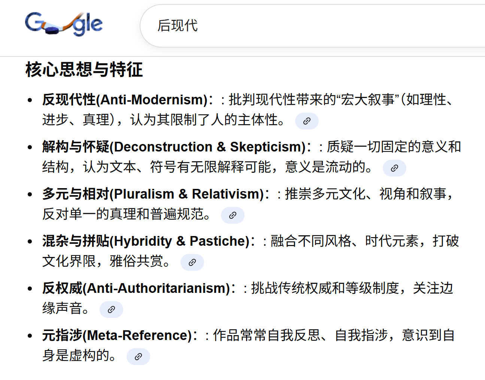

# Ahtohallan主体性

Klein：@🥔 我现在在思考能不能说Ahtohallan把莎冻了。Ahtohallan的主体性还是太强了

JU：观众造神！就在眼皮底下发生了。超时空辉夜姬里的彩叶是神吗，她不是，她说她自己是普通女高中生。但她在观众眼里是吗，大概率是了。

FH：@是168派过来的串子 小圆是神吗？从各种意义上都是。但小焰说她不是神她只是一个普通初中女生

> *2026-02-11 10:51:21  JU*
那现在这里问题就是，同样是一个没有被任何文本代表的“主体意识”确认有神这么一个刻画的Ahtohallan，被不止一个观众认为是“带有主体性的”“创世神”的存在。这是啥啊，这就是后现代。

这种理解本身就是一种艺术，因为当我们讨论Ahtohallan是不是神这个话题的时候，核心关切不是什么Ahtohallan，而是Elsa。是“如果Ahtohallan是神，Elsa会怎么样；不是，Elsa又会怎么样”。这就把Ahtohallan本身刻画一坨的事情糊弄过去了。我的意思是，Klein其实多多少少开了一个潘多拉魔盒

BIM：athl还挺前现代的其实。如果说他做的啥都是正确的。都是正道 都是指引 都是“严厉的父亲”。我们批判肯定是沾上后现代色彩的😁

> *2026-02-11 10:55:47  JU*
如果假定作为观众赋予Ahtohallan主体性合理，那么这就意味着我们批评理论确实多多少少终于沾上了点后现代色彩。但问题是，这与冰学最开始的“从原文本-主创创作意图出发”的初衷相悖。所以假定不合理，就回到了FH和馄饨最开始的经典/古典批评范畴。选哪个呢，从指导实践（创作同人）唯物主义出发，两条路都一样，因为不妨碍大伙写同人。但对于“如何合理理解冰二”这个问题来说，可能略显重要。

BIM：那就不得不提eva了。痞子很清楚，宫崎骏说的对“EVA里面什么都没有”。但EVA虽然内核空，但有结构性。这个结构像是一个杯子，用各种设定、看似高大上的哲学、宗教概念捏出来的杯子。当观众在杯子里倾注自己的感情、映射自己思想时，这部作品就不空了，就有意义了。（也就不能批评了，两极分化严重）😁。所以，很多被批“太后现代了”的作品会自然而然地衍生同人作品。

JU：我记得这就是宫老爷批评痞子的出发点。所以当时我说，“冰三全面日化，也好”。“往小了写，往空了写，也好”。

BIM：其实吧，从宫崎骏他前现代老登的观点出发，说的对。”你们年轻人怎么这么多问题？我们那一代人哪有这么多 什么玉玉“““我们啥型号的霉菌轰炸机没见过，你这算个啥？”宫崎骏：“给你找个媳妇就好啦。”可以说eva里啥都没，也可以说啥都有，指几乎把后现代困境都拍完了。而且形成了一套模式了都

JU：而且也只有这个时代能形成这个模式。所有人都能够对外表达自己观点的时候。

BIM：EVA世界观是越来越小（见Topic 3）。世界从一开始就首先缩小到一座城，再缩到一个组织、到主角身边的人际关系。然后人际关系再崩坏，进一步退缩到主角的内心。最后连自己的内心也维持不住走向崩坏和消解……。可以说这二者创作模式就是 没有调和的可能。但我不认为宫崎骏的评价，是对痞子的否定，倒更像是长辈对年轻人的关心。因为他劝他休息一会儿，还帮他找媳妇。从新剧场版的结果来看，药到病除了属于是。

JU：（宫崎骏的故事世界观）大到看不懂，例如你活

FH：@是168派过来的串子 对于“这么一个刻画的Ahtohallan，被不止一个观众认为是“带有主体性的”“创世神”的存在。” Ahtohallan相关的问题其实都源于F2里存在大量“降神”的桥段，虽然没有任何明确证据指向Ahtohallan是这些操作后的大手子，但根据奥卡姆剃刀只能这么归纳，不然引出所谓“自然意识”这么个玩意那更虚了

JU：所以说奥卡姆剃刀有限制啊。艺术之所以成为艺术，就是因为它可以用不同哲学解释。

FH：@是168派过来的串子 但这符合JL的创作逻辑，如非必要勿增实体

> *2026-02-11 11:08:47  JU*
问题是它是有了实体（必要的北地、必要的Ahtohallan），但是缺乏足够的行为，或者是我们说的故事逻辑（北地、Ahtohallan和四灵之间的逻辑）。在我的理解里，这就是菜。如果是好的情节，那奥卡姆大家都懂，放到故事情节的祖师爷，从卡桑布兰卡到公民凯恩。

FH：@是168派过来的串子 这个确实没得洗，这几个官方小说都不怎么敢碰这个大坑。空搭了史诗的框架和风格，最重要的魔法世界观没填上。

土豆：要么是根本没有借助实体，直接半空中建第二层楼。要么就是借助了实体但是逻辑很垃圾[表情]

> *2026-02-11 11:13:09  JU*
我想说的意思就是，虽然这块我是觉得菜是菜了，但是还得吃，只是，得选个路线，或者找个能调和这个矛盾的分析路线。每次讨论ahtohallan。就是，以“啊我操你的ahtohallan怎么这么难分析”结尾。或者就是“对于这个问题，咱等冰三看看能不能填坑”。然后我就会重复一遍“我赌2毛5这块不会填”。但事实上这是有得解的

FH：@是168派过来的串子 连Mari在DS后记里都会吐槽”dive deep into the lore, but not too deep to avoid the messy drowning part.” 这种话的情况可见一斑了。

> *2026-02-11 11:16:34  JU*
一旦我们选择Klein说的那种赋予Ahtohallan合理性，或者说直白点，像BIM佬说的那样按eva分析Ahtohallan。这至少能整个新活，而不是蹲冰三。

> *2026-02-11 11:16:53  发粪涂墙的🥔*
主要是如果去解的话会使得以后的线路非常的受约束

JU：对，因为一旦冰三不这么搞，就乐了。

FH：@是168派过来的串子 走这种后现代解读模式最大的风险你也说了，很大概率会和F3路线完全不一致。

JU：我其实没说大概率hhh，只是说有这个风险。所以我其实。。。毕竟两条路都能走嘛。

## P.S. 关于后现代

BIM: 我再说一遍我之前提到的例子.就是你小学美术课老师让你画个太阳。大伙一般画的都是红色或者黄色的圆，这就是一个很传统或者很现代的太阳。然后现在你画了个蓝色的圆，众人感到很另类，那它就是一个后现代太阳。但后面大伙都理解 接受，甚至流行这个蓝色的圆了，他就不再后现代。然后这时候你画了一个黑色的三角形，坚持说这个也是太阳。那就诞生了新的后现代。

JU：然后“现在你画了个蓝色的圆，众人感到很另类，那它就是一个后现代太阳。“这里tricky的点就是，我们怎么处理色盲群体眼中看到的太阳。前者是文学批评理论，后者是观众批评理论

## 续：Athl 扼住叙事、迷雾是锁

> *2025-06-30 22:34:03  JU*
无论Ahtohallan的动机如何，它在叙事上的作用，或者说它提供的叙事动力及方向是定死的：冻住Elsa，把话筒交给Anna，而不是两姐妹（的意志）同时在线干成某件事情。悲哀的是，由于Ahtohallan的目前这样一个不明不白的塑造，先前「Elsa为什么要被赐予魔法」的答案也跟Ahtohallan绑死了。

Anna of Arendelle：四灵或许不只是在意环境破坏，更在意的是人心的背叛。大坝本身是谎言和贪婪的物理体现，但真正触发封锁的是鲁纳德对北地人的背叛行为。迷雾可能不完全是惩罚，更像是保护——把双方隔离开，避免更大的伤害，等待能够揭露真相、修复关系的人出现。

FJZ：大坝更像是一把迷雾的锁，建立了，就锁上了，破坏了，就解开了。

JU：抛开引导员对基督教的执念不谈，如果他后面能从自然神教（日本神社供的全是自然神）出发解释 Ahtohallan，会有一些很有意思的发现。

Snowflake：如果不把 pn 或者其他官方读物参考，那 athl 怎么运作的其实就是无解。对于 ahtl 有自主意识这件事，确实是 pn 实锤的。

## 续：冰宫不是 Athl，亲女儿待遇

FrozenHeart（2026-08-13）：Ahtohallan 跟冰宫可不是一码事，冰宫是 Elsa 为了隔离自己临时搞出来的，到 F1 结局使命已经结束了；Ahtohallan 是创世神级别，往深了说 F1 F2 全是她背后在下的一盘棋，而且很多设定还没完善。F3/4 不把这些坑填明白「我秒从 JL 吹变 JL 黑」。

Elsa 的魔法相当于 Ahtohallan 直系魔法，亲女儿待遇，比其他四灵自由度也高很多。纯单独行动其实实力不强，有 Ahtohallan 支持直接改天换日；Elsa 是特例，在没有 Ahtohallan 支持的条件下照样能搞永冬。

全文见 [[饮茶室QA/冰学独立理论与分析/Ahtohallan设定相关理论]]。这是「幕后大手」路线的操作细则：Elsa 不是四灵里多出来的吉祥物，是直系；冰宫不要再拿来和冰川神殿互换。
